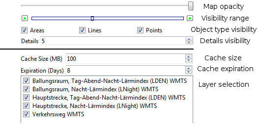
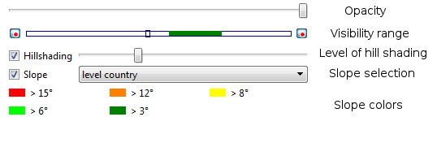

[Prev](AdvProjActions) (General Actions) | [Home](Home) | [Manual](DocMain) | (Maps: Tips and Tricks) [Next](DocMapsTipsTricks)
- - -
[TOC]
- - -

# Details of map use

## Adjustable map properties

_(valid starting with QMS patch version 7440c9d6402c (2017-01-01))_

After activating a map in a map view, some properties that control the display of the map can be adjusted.
The number of properties depends on the type of the map. Their availability is shown in the next table:

Property | vector map | offline raster map | online  map
---------|------------|--------------------|------------
Map opacity               | ✔ | ✔ | ✔
Visibility range          | ✔ | ✔ | ✔
Visibility by object type | ✔ | ✘ | ✘
Details visibility        | ✔ | ✘ | ✘
Cache size                | ✘ | ✘ | ✔
Cache expiration          | ✘ | ✘ | ✔
Layer selection           | ✘ | ✘ | ✔
_Data opacity_            | ✔ | ✔ | ✔

The following image shows the layout of the various selection possibilities in the map tab:

_Comments:_

* The map opacity controls the map visibility in a map overlay.
* The visibility range controls the zoom levels for which the map is displayed.
* The visibility by object type allows to suppress the display of some object types in the map.
* The details visibility controls how many map details are shown at a given zoom level.
* The data opacity (slider in the data and not in the map tab!) controls the visibility of the data in the workspace.

## Adjustable elevation properties

After activating elevation data (DEM data), some properties that control the display of this data in a map view 
can be adjusted.

The following image shows the layout of the various selection possibilities:

_Comments:_

* The opacity slider controls the visibility of hill shading and slope on a map.
* The visibility range controls the zoom levels for which hill shading and slope are displayed.
* The level of hill shading controls the intensity used for the display of hill shading.
* The slop selection allows to choose one of the predefined slope models. In the case of the "__custom__" model
  the user can define 5 slope levels.
  
- - -
[Prev](AdvProjActions) (General Actions) | [Home](Home) | [Manual](DocMain) | [Top](#) | (Maps: Tips and Tricks) [Next](DocMapsTipsTricks)
