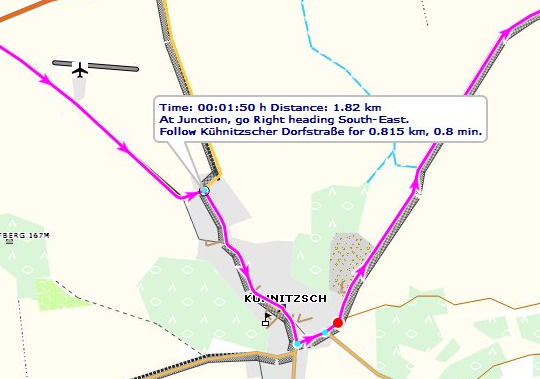
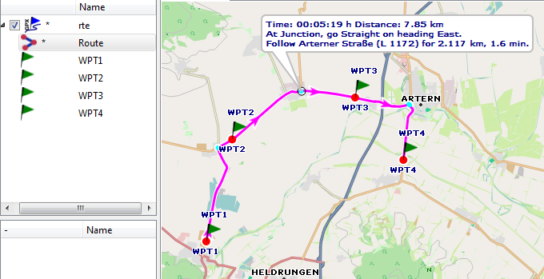
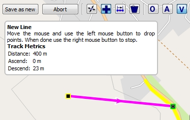

[Prev](AdvTrkElevation) (Editing elevation data) | [Home](Home) | [Manual](DocMain) | (Frequently Asked Questions) [Next](DocFaq)
- - -
[TOC]
- - -

# Routes and Routing

## Create a route

A route consists of

* an ordered list of waypoints through which the user wants to pass,
* a strategy how to move from one waypoint to the next one.

When selecting a routing strategy the user has to decide about features like

* used routing engine (online or offline routing),
* used road network (used map),
* preferred road types (motorways, toll roads, unpaved roads, ...),
* used transportation type (foot, bicycle, car, ...),
* fastest or shortest route.

To create a route in QMapShack (QMS) the user can proceed as follows:

1. Open a QMS map view
1. Open the route tab by selecting the menu entries `Window - Route`
1. Choose `Routino (offline)` in the combobox on top of the route tab for offline routing (the recommended routing method
which is described in this section).
1. Make necessary selections in the `Profile, Language, Mode, Database` comboboxes (for the preparation of a routing 
database compare the section [Routes](DocGisItemsRte#markdown-header-routing-engines)). 
1. Move the mouse pointer to the first waypoint of the route in the map view
1. Right-click the mouse and select `Add route` from the context menu which pops-up. A toolbox appears on the top of the map
view.
1. Press `CTRL-A, CTRL-O` or `CTRL-V` to select a routing method 
(described in detail [here](#markdown-header-description-of-routing-methods-in-qmapshack))
1. Move the mouse pointer to the next waypoint of the route in the map view and left-click the mouse. After a
short moment the route connecting the selected waypoints is shown. _Remark:_ The first waypoint is shown with a yellow border, 
the next one with a green border. Select
  the correct location of the green waypoint with a left click of the mouse and proceed to the next waypoint 
  in the same way. A change of the routing method during the route creation procedure is allowed. The newly selected
  method will be applied to all following new waypoints.
1. Repeat the previous step up to the end of the route
1. Reaching the last waypoint of the route right-click the mouse.
1. Select `Save as new` in the toolbox, assign a name and a project to the route 

While creating a route bubble boxes provide additional information about the meaning of an option or the next step.

If an internet connection is available then in the top combobox of the route tab `MapQuest (online)` can be selected.
In this case proceed in a similar way as described for offline routing. The selected waypoints are connected by straight
lines. After saving the new route left-click on the route. In the toolbox shown select `Calculate route` (wheel icon).
After a short time interval the online router returns its result and the final route is shown in the map
window.

## Edit a route

An existing route can be modified and edited in various ways:

* _Change of the routing method/recalculation of route:_
    * Change selections in route tab
    * Change QMS routing method used (press `CTRL-A, CTRL-O` or `CTRL-V`)
    * Left-click on the route. In the toolbox shown select `Calculate route` (wheel icon). The route will be recalculated using the 
      newly selected routing method.
* _Change location of route waypoint:_
    * Left-click on route in map view
    * Choose `Move route points` from the toolbox
    * Waypoints with a yellow or green border frame can be moved with the mouse to a new location     
    * Left-click at the new location to fix the waypoint
    * Repeat previous step as long as necessary
    * When finished click `Save to original` or `Save as new` from the toolbox at the top of the map window

## Get route instructions

* Open some map which can display the route under consideration
* Double-click the route name in the workspace to see the route on the map
* Right-click on the route name and select the context menu entry `Route Instructions` _or_ left-click on the route
in the map window and select `Route instructions` 
* Points on the route with instructions are shown in light-blue
* Move the mouse pointer on a light-blue point
* See the instructions for the given point in a bubble box

## Save route in GPX file

Routes can be saved in GPX files. When checking the information in such a GPX file it can be seen that only the ordered
list of route waypoints is contained in the file. This fact needs some explanation.

When following a route the user expects at all junctions (and only there) information about the necessary 
turn in the selected language 
(next direction, road number, distance to next junction, ...). No additional information is needed and therefore 
no additional information is shown between 2 junctions.

In the following picture the selected waypoints are shown as red dots on the route. Blue dots on the route show 
junctions with routing information.

Having the ordered list of route waypoints and the map data (more precisely the routing data of a map and also the 
routing engine and its settings) the route
can easily be recalculated by the routing algorithm. This is the reason why when saving a route in form of a portable 
GPX file
only the route waypoints are saved. In addition to this the GPX data format does not support the type of information
mentioned above for junctions.

When loading a route from a GPX file into QMS (or into another tool - the file format is portable!) the route has to 
be recalculated. 
An implication of this is that a transfer of a route
in form of a GPX file from one soft- or hardware tool to another one can lead to a different route due to a different 
routing algorithm or different map (routing) data.

QMS can transform a route into a track. This track shows exactly the path to follow but doesn't include the above mentioned
routing information for junctions. This track can be stored together with the route (more precisely the route waypoints)
in a GPX file. In this file the route and the track are 2 independent objects!

_Remark:_ There are some software applications saving a route together with this track in a proprietary 
non-portable format which links route and track data. 

## Description of routing methods in QMapShack

When creating a new route QMS offers 3 different offline routing methods.
_Remark:_ These methods work in the same way for track and for route creation. 

* _Method 1:_ Off-road routing:
    
    Select this method by clicking on the toolbar icon `O` or by pressing `CTRL-O` (easier!).
  
    The selected wapoints are connected by a straight line segment as shown in the previous image.

* _Method 2:_ Routing with a Routino database:
    
    Select this method by clicking on the toolbar icon `A` or by pressing `CTRL-A` (easier!).
  
    This method can be used only after a special preparation of an offline routing database as described in the section 
    [Routes](DocGisItemsRte). The map is used only to locate the waypoints properly. Thus, raster maps (e.g. 
    Russian military maps) are appropriate.

    The routing algorithm applies the parameters selected in the Route window (foot - bicycle - motorcar, ...). 
    
    * _Advantage of this method:_ Fast routing not depending on map data.
    * _Disadvantage:_ From time to time unexpected routes longer than necessary. There are many reasons for this 
        behavior (e.g. incorrect map data used for creating the routing database, location
        of mouse pointer not precise enough).
    
* _Method 3:_ Routing with vector map data:

    Select this method by clicking on the toolbar icon `V` or by pressing `CTRL-V` (easier!).
  
    This method can be used only with a vector map. A routing database as described in method 2 is not required. 
    As soon as 2 consecutive waypoints can be connected by a
    polyline (a sequence of straight line segments) contained in the map this polyline is used as part of 
    the new route connecting the waypoints considered. If such a polyline is not found in the map then a straight line 
    segment will be used to connect the waypoints.
    
    The following image shows a first new route segment. Its endpoint is on a road of the map (a polyline of the map).
    The yellow part of the road is the extent of this polyline. If the next waypoint is selected on this yellow part
    then the route follows this road up to this point.   
    
    
    
    * _Advantage of this method:_ Off-road and on-road routing can be mixed.
    * _Disadvantage:_ Quite often very short map polylines. Thus, many intermediate waypoints are required.

- - -
[Prev](AdvTrkElevation) (Editing elevation data) | [Home](Home) | [Manual](DocMain) | [Top](#) | (Frequently Asked Questions) [Next](DocFaq)
