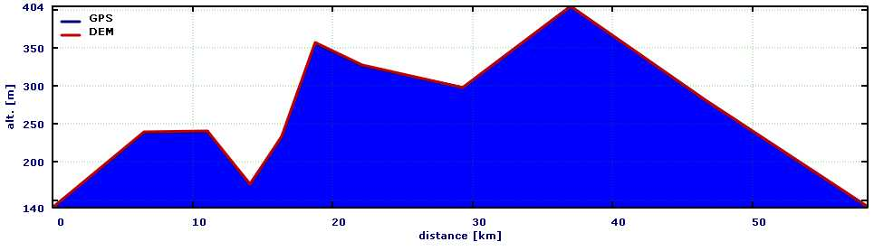
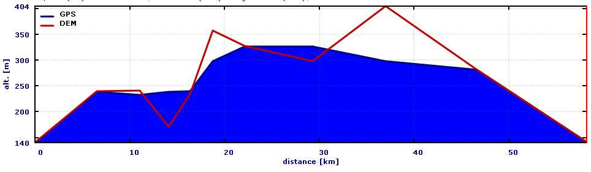
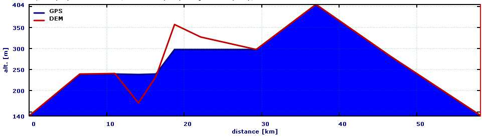
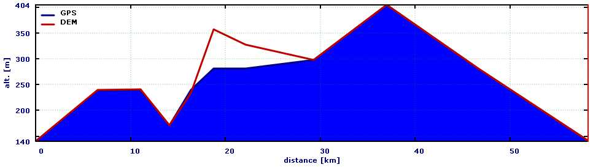
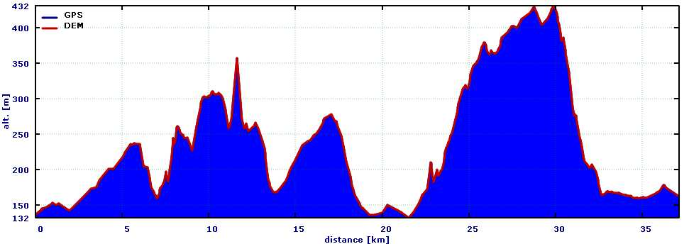
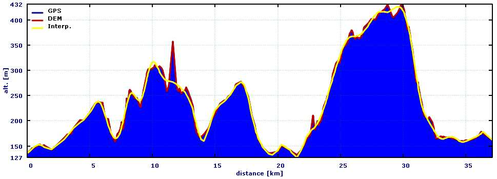
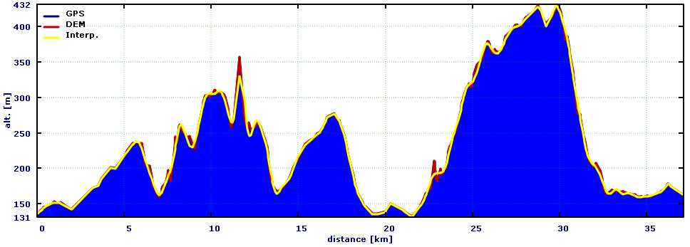
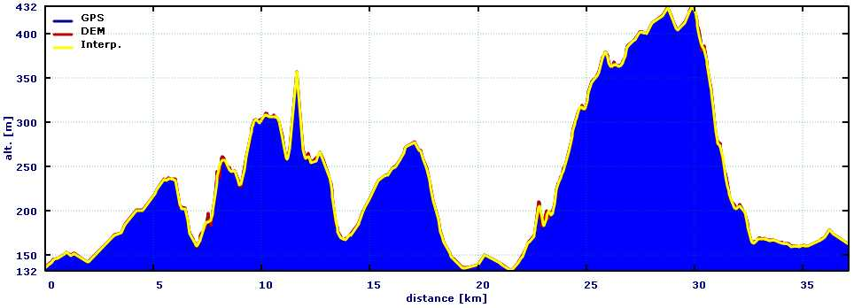

[Prev](AdvTrkGeneral) (General topics) | [Home](Home) | [Manual](DocMain) | (Working with track graphs) [Next](AdvTrkGraphs)
- - -
[TOC]
- - -

# Track filters

Track filters are tools to manipulate a track in a predefined way. QMS supports track filters for elevation, 
timestamps, splitting of tracks and others.

To apply a track filter proceed as follows:

* Right click on the track name in the workspace
* Select the context menu entry `Edit...`

_or_

* Click on the track in a map window
* Click the `View details and edit properties of track` icon in the track info window that pops up.

_In both cases_

* Click on the `Filter` tab in the lower part of the edit window to see a list of available track filters.

## Elevation filters

Track elevation filters can be found under the header `Change elevation of track points` in the filter tab.

QMapShack offers the following filters for track elevation:

* Smooth profile (Median method)
* Interpolate elevation data
* Replace elevation data
* Offset elevation

### Median filter

This is a filter for smoothing the elevation profile of a (recorded) track.

The user has to select a number of trackpoints (5, 7, or 9) as a parameter to the filter.

The new elevation of a trackpoint is the median of the elevations of the selected number of trackpoints 
around the trackpoint. Assuming 5 points then 2 trackpoints before and 2 trackpoints after the given one
are selected, the 5 elevations are ordered and the middle one (the _median_) is used as new elevation.

A lower number of selected points results in a smoother elevation profile as can be seen in the following 
images (showing the original profile and the results of the 5, 7, and 9 points filter). 
A higher number of selected points results in an elevation profile closer to the original one.

This filter requires a sufficiently large number of trackpoints in the track under consideration,
otherwise it can't be used.

### Interpolation filter

This is a filter for smoothing the elevation profile of a (recorded) track.

The user has to select if he wants to apply a coarse, medium or fine filter.

The new elevation of a trackpoint is calculated from a cubic spline interpolation.

The smoothness of the elevation profile increases in the order _fine - medium - coarse_. The fine interpolation filter
results in an elevation profile closer to the original one than the elevation profile obtained from the coarse filter
as can be seen in the following images (showing the original profile and the results of the coarse, medium, and fine 
filter).

This filter requires a sufficiently large number of trackpoints in the track under consideration,
otherwise it can't be used.

### Replace elevation data

This filter replaces the elevation data of the given track with elevation data taken from the DEM data loaded
into QMS. 

If a track doesn't have elevation data, then elevation data can be added to the track with the help of this filter.

### Offset elevation

A fixed value selected by the user is added to the elevation of each trackpoint.

## Miscellaneous filters

### Remove extension from all trackpoints

Depending on their source trackpoints may have different sets of properties.
This makes it possible to add fitness data to trackpoints. These additional properties are saved as extensions 
in a GPX file.

This filter displays for a given track a list of available extensions (properties). Applying the filter
removes the selected extension (temperature, heart rate, recorded speed, ...) from the trackpoint data. 

### Split segments into tracks

This filter can be seen as the reverse operation to combining (joining) of tracks.

Each track consists of at least one track segment.
When combining tracks the track segments of all tracks involved are copied in the selected order into the new track.
Thus, combining several tracks leads to tracks with several segments.

When applying the given filter to a track, then each track segment is converted to a separate track. The project
in which the new tracks are saved can be defined by the user. The new tracks get the name of the original track
with a _(segment xx)_ suffix.

### Convert track subpoints to points

(_valid starting with QMS patch version 7ac34c818ec1/2016-12-06_)

When creating a track, the user creates with the help of mouse clicks (ordinary) trackpoints. Depending on the selected
[routing method](AdvRoutes#markdown-header-description-of-routing-methods-in-qmapshack) 
additional trackpoints are be added automatically by the routing algorithm. These additional trackpoints are 
called _subpoints_. 

Ordinary trackpoints (marked with a big black square when editing a track) can be moved to a new location or deleted 
while editing the track.

Subpoints (marked with a small black square when editing a track) can't be edited. They are adjusted automatically 
if a neighboring ordinary trackpoint has changed.

The given track filter converts each subpoint to an ordinary trackpoint.

- - -
[Prev](AdvTrkGeneral) (General topics) | [Home](Home) | [Manual](DocMain) | [Top](#) | (Working with track graphs) [Next](AdvTrkGraphs)
