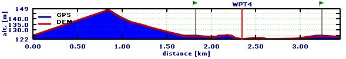

[Prev](AdvTracks) (Tracks) | [Home](Home) | [Manual](DocMain) | (Track filters) [Next](AdvTrkFilters)
- - -
[TOC]
- - -

# Tracks

## Get track information

There are various ways to get information about a track.

* _Using the workspace window:_
    * Move mouse on the name of the track
    * An info window pops up. This window gives summary information about the track:
        * Track name
        * Length
        * Total ascent/descent
        * Total and moving time
        * Total and moving average speed         
        * Start and end time
        * Number of visible and total trackpoints in track
       
      Some of this information can be missing if the track is not recorded by a GPS device.

* _Using the map window:_
    * _Track is displayed without red frame:_
        * Left click on the track
        * An info window pops up that shows the same info as described in the previous point.

      With the help of the icons shown in this info window the user can carry out various operations with the track.
      
      In the style tab of the track edit window the user can select one of the track properties (speed, slope, elevation, 
      fitness data, ...) to be used for coloring the track.
      
    * _Track is displayed with red frame:_
        * To get this state of a track in the map window double click on the track name in the workspace window. The map
          window is zoomed so that the complete track is displayed in the window.
        * Move the mouse pointer on the track
        * An info window pops up that shows information about the closest trackpoint:
            * Distance run from start and distance remaining to the end of the track
            * Time run from start and remaining time to the end of the track
            * Index of the trackpoint             
            * Time at the trackpoint
            * Elevation, slope, speed and fitness data at the trackpoint
        * With a left click on the track the information described in the previous point is displayed.         
        
          Some of this information can be missing if the track is not recorded by a GPS device.
          
        Get out of this track state by then double clicking
        on a location without a track.        

 * _Using the track edit window:_         
     * To open the track edit window right-click on the track name in the workspace window and select the `Edit...`
       menu entry in the context menu.
     * In the graphs tab the user can select up to 3 track properties (speed, slope, elevation, fitness data, ...) 
       to be displayed as graphs.
            
## Attach waypoints to a track to get additional track information

(_inspired by_ [QMS issues list](https://bitbucket.org/maproom/qmapshack/issues/169/distance-between-waypoints-popup-window))

Waypoints can be attached to tracks or more precisely to trackpoints of a given track. 

There are several ways to do this:

* If the track does not yet exist but some waypoints for the track under constructions are already known:
  * Create the required waypoints within one project.
  * Select the waypoints in the project window.
  * Right click and select the context menu entry `Create Route`.
  * In the `Create Route from Waypoints` window move the waypoints into the necessary order and click ok.
  * Enter a route name.
  * Select the target project (the project with the waypoints under consideration) and click ok.
  * Right click on the new route in the project window and select the context menu entry `Convert to Track`.
  * Enter a track name.
  * Select the target project (the project with the waypoints under consideration) and click ok.
  * Delete the temporary route.  
* If the track exists and is displayed in a map:
  * double click on the track in the project window.
  * Zoom the map in such a way that track details (trackpoints) become visible.
  * Move the mouse pointer to the required waypoint location on the track. 
  * A bubble box pops up at the closest trackpoint.
  * Move the mouse pointer to the bubble box, right click and select `Add waypoint` from the context menu.
_Remark:_ If a the selected waypoint has a distance of less than 50m to a trackpoint than it is attached to the track.
  
  
  
* If elevation data for the track is available:  
  * Open the edit window for the track and ensure that the profile graph of the track is displayed.
  * Zoom the graph horizontally with the mouse wheel for better detail.
  * Move the mouse cursor on the profile graph to a location where the index shown in the upper left corner
jumps to a new value (i.e. where a trackpoint is located).
  * Right click and select `Add waypoint` to attach a waypoint to the track.
_Remark:_ If a the selected waypoint has a distance of less than 50m to a trackpoint than it is attached to the track.
  
Having waypoints attached to a track additional information about the waypoints is available in the roadbook of the
project.

To display this information proceed as follows:

* Right click on the project and select the context menu entry `Edit...`.
* The project roadbook opens as additional tab in the upper right part of the user interface.  
* Select the `Sort along track (multiple)` or `Sort along track (single)` entry from the combobox in the 
upper right part of the roadbook.
* Now for each attached waypoint its distance, ascent and descent
    * from the start of the track,
    * to the next attached waypoint, and
    * to the end of the track
  
    are shown together with a summary of the track information. 

* It may happen that a track passes several times through a waypoint (in the example __WPT3__).  This 
happens if the track intersects itself and if an attached waypoint is located at an intersection.   
    * If the option `Sort along track (multiple)` is used then the waypoint is shown several times in the list.
    * If the option `Sort along track (single)` is used then the waypoint is shown only once in the list. The
information given in the roadbook window refers to the last pass through the waypoint.

    

* If the option `Keep order of project`is used then the edit window of the project shows waypoints and tracks in different
tables.
   
Attached waypoints are also shown with their icons - or in the case that the cursor is located at the waypoint position with 
their name - 
in the profile graph of the track (if elevation data is available). To see the profile graph open the edit window for the
track.

A track can be copied together with its attached waypoints to a new project by selecting the track context menu entry
`Copy Track with Waypoints`. 

## Select a range of a track

(_valid starting with QMS patch version  b9235da (18.11.2016)_)

The user can select in several ways a range of a track, that is a sequence of trackpoints of the track, for further handling:

* __Using a map window:__

     * Display the track in a map window.
     * Click with the left mouse button on the track and release the mouse button. 
       An info box pops up. Choose the "_Select a range of points_" icon in this
       info box. The mouse cursor changes to the range selection icon. 
     * Click with the left mouse button at the location of the start of the range to be selected in the track and
       release the mouse button. The clicked point is shown as a circle with red center.
     * Move the mouse to the location of the end of the range to be selected. 
     * Click with the left mouse button at the end of the range.

  
* __Using a graph in an edit window:__

    * Click with the left mouse button at the location of the start of the range to be selected in one of the track 
    graphs and
release the mouse button. A vertical red line jumps to the location of the nearest trackpoint of the track.
    * Move the mouse to the location of the end of the range to be selected __in the same graph__ and click with 
the left mouse button. _Warning:_ If a `No go!` icon pops up at the location of the mouse pointer then the mouse
was moved out of the graph selected with the first click!

In both cases the selected range will be highlighted in green color and the required action for the trackpoint range 
can be selected from the info box that pops up. This info box shows also some summary information about the range.

Select the action to perform with the track range from this info window:

* Hide trackpoints located in the range. The part of the track between start and end of the range will be
  replaced with a straight line. The track remains in the range selection mode, that is, more range selections
  can be made immediately.
           
    The hidden part of the track is shown as a gray track while in range selection mode.

* Show all trackpoints in the range
* Assign an activity type to the range
* Copy range into new track
  
If part of the track is hidden then this is shown in the track info box when moving the mouse pointer on the track
in a map window as shown in the following image:

  
Here, the numbers of visible and of total points are different.

## Assign colors to track activities

**Source:** [Newsgroup discussion](https://sourceforge.net/p/qlandkartegt/mailman/message/35502464)

To assign an activity to a range of a track proceed as follows:

* Select a track range (for details see [here](#markdown-header-select-a-range-of-a-track)).
* In the bubble box that pops up click the `Select an activity` icon.
* Choose the activity from the list which appears.

The graphs in the track edit window show the track activity ranges:

Selecting the `Activity` tab in the edit window shows various information about the activities:

Selecting `Activity` in the `Style` tab of the edit window allows to assign a color for each activity type:

* click the colored square for the activity under consideration,
* a list shows the supported colors,
* select one by clicking on it,
* if the list was opened but no color was changed then press the `ESC` to close the list.

Now the selected colors are displayed on the track (red color: color selected for the track itself - no activity was 
assigned to red parts):

## Recorded and calculated track data

The type of track data recorded with the help of one GPS device differs from the type of track data recorded 
by another GPS device. While the location and the timestamp is recorded for each trackpoint the recording of 
other data such as
* elevation
* speed
* heart rate
* temparature

depend on the used device. There can be even a dependence between different data fields. Thus, speed can
be calculated from locations and timestamps and can be recorded directly.

QMS is in a position to visualize track data in form of graphs in the track edit window and in form
of various colours on the track in map windows. In the _Graphs_ and _Style_ tabs of the track edit window
the user can select the type of data to be displayed. 

A track data field may have a star at the end of its name (_speed*_). This is an indication that the values for 
this data field are calculated internally by QMS from other available data fields. The similar data field without a star 
(_speed_) is for recorded data.

A track may have a calculated _speed*_ (if timestamps are available) and a recorded _speed_ data field at the same time 
and both can be visualized in 2 different graphs. 

When editing a track with the `Change timestamps of trackpoints` filter the recorded _speed_ data remain unchanged 
whereas the calculated _speed*_ data will change their values.

## Avoid and remove invalid data in a track

QMS is a software for

* _managing and displaying of recorded waypoints and tracks_ (GPS data). A recorded track consists of a sequence of recorded
trackpoints. The trackpoint data consists of location, elevation, timestamp and some other data. With the
exception of rare failures caused by the recording GPS device this data is consistent (valid).
 
* _creating new waypoints and tracks_. The creation of a track requires a map so that track points can be properly located.
If elevation data should be added to the track then this data (DEM data) should be available in QMS. Finally,
if routing should be used for track creation then routing data should be available in QMS.

QMS offers quite a few easy ways to create and edit tracks. Among others 

* copy, cut and paste and
* adding and deleting 

of trackpoints are supported.

In a track created with the methods mentioned in the last paragraph 

* can be trackpoints with or without timestamps,
* can different track segments have trackpoints with inconsistent (invalid) timestamps,
* can elevation data be available or not or can be even invalid (see discussion 
[here](AdvTrkElevation#markdown-header-handle-invalid-elevation-data)).

If there are invalid timestamps or elevation data in a newly created or edited track then QMS displays a red warning message in the track info box.

The user should use the __Change timestamps of track points__ filter to remove invalid timestamps.

Different approaches for avoiding or removing invalid elevations are described 
[here](AdvTrkElevation#markdown-header-handle-invalid-elevation-data).

- - -
[Prev](AdvTracks) (Tracks) | [Home](Home) | [Manual](DocMain) | [Top](#) | (Track filters) [Next](AdvTrkFilters)
