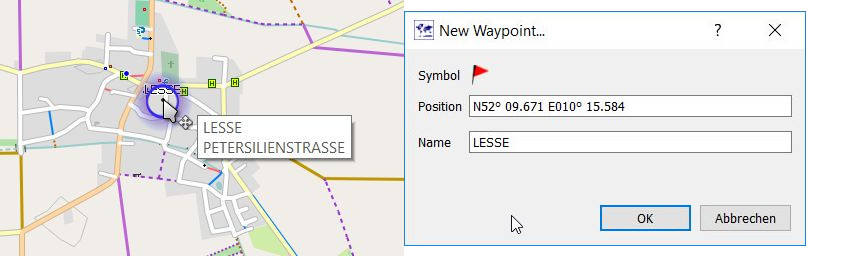
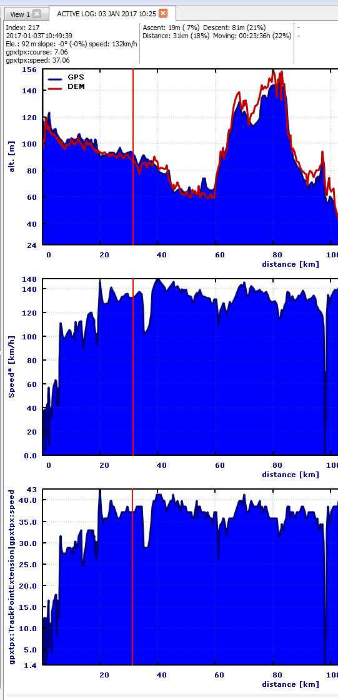

[Prev](DocFaqData) (Databases and projects) | [Home](Home) | [Manual](DocMain) | [Index](AxAdvIndex) | (Routing) [Next](DocFaqRouting)
- - -
[TOC]
- - -

# Frequently Asked Questions - Data handling

## How to create waypoint from POI (point of interest) in map?

If the mouse pointer is moved on a POI in a vector map a small blue circle around this POI pops-up. Right-click to open the context menu and select the menu entry
`Add POI as waypoint`. The POI name and its coordinates are used in the new waypoint.

## How to find distance between waypoints

(_inspired by and partially copied from_ [QMS issues list](https://bitbucket.org/maproom/qmapshack/issues/169/distance-between-waypoints-popup-window))

* _Find the direct distance from a waypoint to some other point:_ set a waypoint and move it to the other point.
  This will give you the distance and the course (direction) to the other point. When done abort the operation (right mouse click) and remove the waypoint.

* _Find a defined distance from several waypoints:_ add the distance as proximity to the waypoints.

* _Find the street distance or the direct distance between several points:_ start to create a track with or without routing.

## Which track data is saved in GPX files?

(_valid starting with QMS patch version 7ac34c818ec1/2016-12-06_)

QMS supports 2 kinds of GPX files:

* GPX files that follow strictly the rules of the GPX 1.1 standard,
* GPX files using additional extensions (_special format_).

In both cases the following track data is saved in the GPX file:

* track name,
* location of each trackpoint,
* timestamp of each trackpoint (if available),
* elevation of each trackpoint (if available).

The additional extensions used in the _special format_ provide information about

* the track history (can't be re-activated when GPX file is re-loaded into QMS),
* the track display color
* the type of a trackpoint (trackpoint created by routing engine (so-called subpoint) or
  trackpoint created by user interaction, hidden trackpoint, activity)

Trackpoints created by a routing engine can't be edited by the user whereas trackpoints
created by a user can be
edited (compare section ["Edit items with multiple points"](DocGisItemsEditMultiple)).

## What is the difference between speed and gpxtpx:speed?

Various GPS receivers record different data for trackpoints. Some Garmin navigators use for this purpose
a special [GPX trackpoint extension](http://www8.garmin.com/xmlschemas/TrackPointExtensionv2.xsd "Garmin gpxtpx trackpoint extension")
named `gpxtpx`. One of the data fields within this extension is `gpxtpx:speed`. It records the speed at the given trackpoint.
This speed is measured in meters per second whereas the calculated speed at a trackpoint is measured in kilometers per hour.

QMS reads this speed value and can display it in form of a graph in the track edit window.

A similar data field is `gpxtpx:course`. This field contains an angle measured in degrees in a clockwise direction from the true north line
(the _course_).

Compare also section 
[Recorded and calculated track data](AdvTrkGeneral#markdown-header-recorded-and-calculated-track-data "Recorded and calculated track data").

- - -
[Prev](DocFaqData) (Databases and projects) | [Home](Home) | [Manual](DocMain) | [Index](AxAdvIndex) | [Top](#) | (Routing) [Next](DocFaqRouting)
