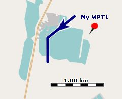
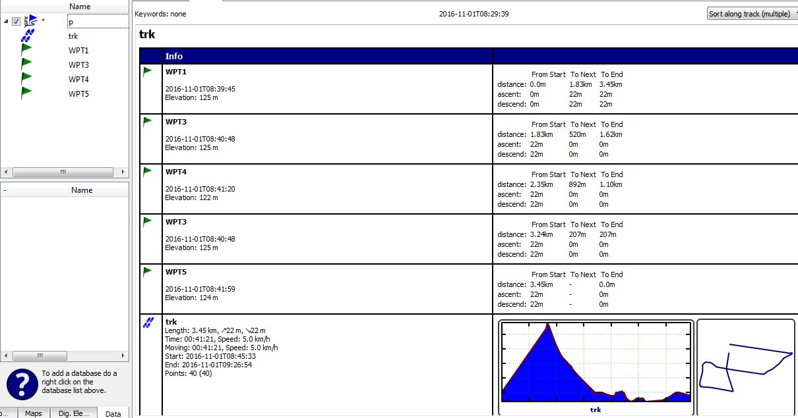

[Prev](DocFaqData) (Databases and projects) | [Home](Home) | [Manual](DocMain) | (Routing) [Next](DocFaqRouting)
- - -
[TOC]
- - -

# Frequently Asked Questions - Data handling

## Which hotkeys are available in QMapShack?

Hotkey | Meaning
--------|---------
__Routing__ |
CTRL-A | Use routing algorithm with options selected in the routing window when creating route or track. Choice can be modified during routing. No map data required.
CTRL-O | Use straight lines for routing when creating route or track. Choice can be modified during routing. 
CTRL-V | If available use polyline from map for routing from one point to the next one (_snap to line_), otherwise use straight lines. Choice can be modified during routing. No routing data required
__Track edit mode__ |
CTRL-+ | Add trackpoints to track.
CTRL-D | Delete trackpoints.
CTRL-M | Move trackpoints.
CTRL-R | Select range of track points.
__General__ |
CTRL-E | Show extended track profile (toggle!).
CTRL-G | Show grid on map (toggle!).
CTRL-ALT-G | Open grid setup window.
CTRL-I | Show map tooltips (type of map object at cursor location, toggle!).
CTRL-L | Load GIS data.
CTRL-P | Print selected map area.
CTRL-Q | Close QMapShack.
CTRL-S | Save all projects from the workspace.
CTRL-T | Add new view tab.
CTRL-SHIFT-T | Clone map view.
__Map__ |
up-key     | Move the map focus north, moving the map south 
down-key   | Move the map focus south, moving the map north
left-key   | Move the map focus west, moving the map east
right-key  | Move the map focus east, moving the map west
+          | Zoom into the map
-          | Zoom out of the map

When in text edit fields the usual hotkeys can be used.

## How to avoid or remove invalid data in a track?

QMS is a software for

* _managing and displaying of recorded waypoints and tracks_ (GPS data). A recorded track consists of a sequence of recorded
trackpoints. The trackpoint data consists of location, elevation, timestamp and some other data. With the
exception of rare failures caused by the recording GPS device this data is consistent (valid).
 
* _creating new waypoints and tracks_. The creation of a track requires a map so that track points can be properly located.
If elevation data should be added to the track then this data (DEM data) should be available in QMS. Finally,
if routing should be used for track creation then routing data should be available in QMS.

QMS offers quite a few easy ways to create and edit tracks. Among others 

* copy, cut and paste and
* adding and deleting 

of trackpoints are supported.

In a track created with the methods mentioned in the last paragraph 

* can be trackpoints with or without timestamps,
* can different track segments have trackpoints with inconsistent (invalid) timestamps,
* can elevation data be available or not or can be even invalid (see discussion in the following 2 sections of this page).

If there are invalid timestamps or elevation data in a newly created or edited track then QMS displays a red warning message in the track info box.

The user should use the __Change timestamps of track points__ filter to remove invalid timestamps.

Different approaches for avoiding or removing invalid elevations are described in the following 2 sections of this page.[Link](#what-to-do-if-a-track-has-invalid-elevation-data)

## How to edit the elevation of a track point manually?

* Open the edit window for the track, 
* ensure that track data can be edited (open lock in description part of edit window - if lock is closed, click it!)
* go to the _Points_ tab, 
* find the track point to be edited, 
* double-click in the elevation column,
* set the new elevation in the pop-up window.

## What to do if a track has invalid elevation data?

_Remark: This explanation refers to QMapShack patch version a7dbbfb (11.11.2016) and later ones!_

Assume DEM (**D**igital **E**levation **M**odel) data is available in QMS for the area under consideration. Create
a track in this area. Then QMS adds automatically elevation data to the track that can be checked in the track profile and
in the trackpoint list of the track edit window.

It may happen that the trackpoint list shows a warning of the form __"Invalid elevations!"__ and some trackpoints do not have
an elevation assigned to them as can be seen in the following image (once a waypoint is marked as invalid don't look at
other elevation-dependent data - they are invalid, too!):

A similar situation can be noticed in the status line. If the mouse pointer is at a location in the map then normally the
status line shows the coordinates of the location and its elevation:

In some cases the elevation can be missing in the status line:

The area (map) in which the track is located doesn't show anything special:

The reason for the missing elevation data is the source of the elevation data (in the example discussed 
a file `N51E011.hgt`). Elevation data
is normally taken from satellite measurement (SRTM data) and this data may have gaps, i.e. small areas without valid elevation
data. These gaps are marked in the HGT files as `NODATA` areas. If a trackpoint is located in such an area then QMS can't
assign an elevation to this trackpoint.

If there is an urgent need to avoid these missing elevation values the user can select one of the following procedures:

* (_optimal procedure_) Try to find a source of DEM (SRTM) data with improved quality, i.e. with data where the
above mentioned gaps have been removed using various techniques. For Germany the
[opendem.info](http://opendem.info/download_srtm.html) server is such a source. 
* Use the QMS __Reduce visible track points__ filter to __hide invalid track points__. Check if 
the resulting changes of the track can be accepted. If so, use this filter again to finally __remove 
invalid points__.

* Use the QMS __Change elevation of track points__ filter to __interpolate elevation data__. Check in the __preview__ 
if the resulting interpolated (smoothed) track profile can be accepted. If so, apply the filter.

* (_tedious procedure_) Manually edit elevation data with data taken from a different source (e.g. raster map
with elevation data).

* (_unreliable procedure_) If the area is rather flat then gaps in HGT files can be filled in with a default average elevation 
value with the help of the `GDAL` package. On a command line 2 steps have to be executed:  

    * Convert the `NODATA` value of the source file to the wanted average value (in the example 50m, use full paths!)

             gdalwarp N51E011.hgt -of VRT N51E0111.hgt -dstnodata 50

    * Unset the `NODATA` flag in the HGT file so that 100 is considered as a regular value.  

             gdal_translate N51E0111.hgt -of VRT N51E01111.hgt -a_nodata none

    * Use the new HGT file (more precisely: its VRT file) in QMS

  The result of this procedure is shown in the following images:

  
  
## How to find distance between waypoints

(_inspired by and partially copied from_ [QMS issues list](https://bitbucket.org/maproom/qmapshack/issues/169/distance-between-waypoints-popup-window))
 
* _Find the direct distance from a waypoint to some other point:_ set a waypoint and move it to the other point. 
  This will give you the distance and the course (direction) to the other point. When done abort the operation (right mouse click) and remove the waypoint.

* _Find a defined distance from several waypoints:_ add the distance as proximity to the waypoints.

* _Find the street distance or the direct distance between several points:_ start to create a track with or without routing.

## How to attach waypoints to a track to get additional track information

(_inspired by_ [QMS issues list](https://bitbucket.org/maproom/qmapshack/issues/169/distance-between-waypoints-popup-window))

Waypoints can be attached to tracks or more precisely to trackpoints of a given track. 

There are several ways to do this:

* If the track does not yet exist but some waypoints for the track under constructions are already known:
  * Create the required waypoints within one project.
  * Select the waypoints in the project window.
  * Right click and select the context menu entry `Create Route`.
  * In the `Create Route from Waypoints` window move the waypoints into the necessary order and click ok.
  * Enter a route name.
  * Select the target project (the project with the waypoints under consideration) and click ok.
  * Right click on the new route in the project window and select the context menu entry `Convert to Track`.
  * Enter a track name.
  * Select the target project (the project with the waypoints under consideration) and click ok.
  * Delete the temporary route.  
* If the track exists and is displayed in a map:
  * double click on the track in the project window.
  * Zoom the map in such a way that track details (trackpoints) become visible.
  * Move the mouse pointer to the required waypoint location on the track. 
  * A bubble box pops up at the closest trackpoint.
  * Move the mouse pointer to the bubble box, right click and select `Add waypoint` from the context menu.
_Remark:_ If a the selected waypoint has a distance of less than 50m to a trackpoint than it is attached to the track.
  
  
  
* If elevation data for the track is available:  
  * Open the edit window for the track and ensure that the profile graph of the track is displayed.
  * Zoom the graph horizontally with the mouse wheel for better detail.
  * Move the mouse cursor on the profile graph to a location where the index shown in the upper left corner
jumps to a new value (i.e. where a trackpoint is located).
  * Right click and select `Add waypoint` to attach a waypoint to the track.
_Remark:_ If a the selected waypoint has a distance of less than 50m to a trackpoint than it is attached to the track.
  
Having waypoints attached to a track additional information about the waypoints is available in the roadbook of the
project.

To display this information proceed as follows:

* Right click on the project and select the context menu entry `Edit...`.
* The project roadbook opens as additional tab in the upper right part of the user interface.  
* Select the `Sort along track (multiple)` entry from the combobox in the upper right part of the roadbook.
* Now for each attached waypoint its distance
    * from the start of the track,
    * to the next attached waypoint, and
    * to the end of the track
  
    is shown. 

_Hint:_ It may happen that a waypoint is displayed several times in the list (in the example __WPT3__). This 
happens if the track intersects itself and if an attached waypoint is located at an intersection.   
  

 
Attached waypoints are also shown with their icons - or in the case that the cursor is located at the waypoint position with 
their name - 
in the profile graph of the track (if elevation data is available). To see the profile graph open the edit window for the
track.

- - -
[Prev](DocFaqData) (Databases and projects) | [Home](Home) | [Manual](DocMain) | [Top](#) | (Routing) [Next](DocFaqRouting)
