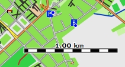
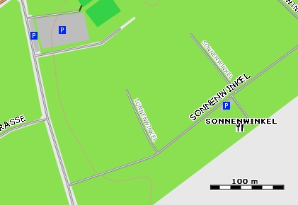
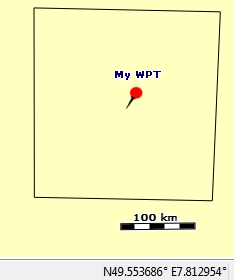
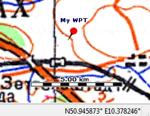
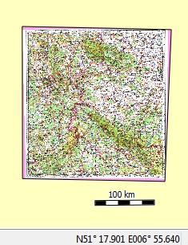
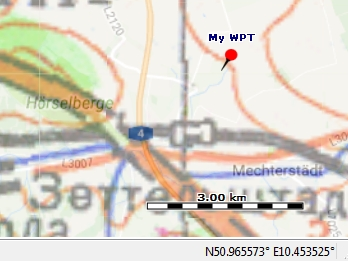

[Prev](DocFaqRouting) (Routing) | [Home](Home) | [Manual](DocMain) | [Index](AxAdvIndex) | (Troubleshooting QMapShack) [Next](TroubleShooting)
- - -
[TOC]
- - -

# Frequently Asked Questions - Maps

## Why are waypoints shown with a blue dot icon?

**Source:** [Newsgroup discussion](https://sourceforge.net/p/qlandkartegt/mailman/message/35441910/)

_Example:_

The blue dots shown on the map are not the icons of waypoints but they are used as indicators that at the given zoom level
of the map and at the given locations there are several waypoints on the map. Thus, cluttering of the map is avoided.

Changing the zoom level results in the display of all waypoints at the given location with the necessary icons (exception:
several waypoints with equal coordinates).

## What is the difference between `Copy position` and `Copy position (Grid)`?

A right click in a map window at a certain positions opens a context menu which offers (among others) the 2 choices:

* `Copy position`
* `Copy position (grid)`

In the first case the position is copied in the format used to display coordinates (see menu `View - Setup Coord. Format`),
e.g `N49° 21.734 E012° 44.146`

In the second case the position is copied as a pure grid coordinate.
For long/lat coordinates it is degrees (`49.599924 10.599991` or `-15.065344 -39.915421`). For northing/easting
coordinates it is meters. (`6307013m, 1415953m`)

## Is there a possibility to display small roads/tracks in a vector map without zooming in too much?

**Source:** [www.naviboard.de](http://www.naviboard.de/vb/showthread.php?t=59676)

This problem appears with a vector map like [Freizeitkarte](http://www.freizeitkarte-osm.de/) where smaller
roads/tracks are only visible at a zoom level where the overview gets lost.

There is no such possibility in QMapShack. The detail levels for vector map data are defined by the map author and can't be
changed within QMapShack.

Users reported about the following ways to improve the visibility of small roads:

* Choose the menu item `View - Setup Map View - Projections&Datum`
* Append to the given configuration string one of the following strings:
  * `+lat_ts=60` This sets the *latitude of true scale* for a Mercator projection. The closer you get to the polar regions the more the map will be skewed horizontally in comparison to the vertical scale. At the *latitude of true scale* (usually 0 for the equator) the scales are equal.
  * `+k_0=0.3` (**Source:** [gmane.comp.gis.qlandkartegt](http://article.gmane.org/gmane.comp.gis.qlandkartegt.user/2688))  This is an additional scale factor on the normal scale. A value of 1.0 will have no effect. Try to increase or decrease the given value to get the wanted result

## Does QMS support the use of single Garmin-style map tiles?

A map in the Garmin format consists of single map tiles plus a so-called _type file_ which describes how the elements
in the map should be displayed. The map tiles for a given area are typically packed together with a type file
into a special container format. A typical name for such a container file is _gmapsupp_xxx.img_.

QMS does support maps loaded from gmapsupp container files. It doesn't allow the use of single tiles.

## Which raster map formats are supported?

There are various sources of raster maps in various formats.

QMS supports raster formats that are
* supported by `GDAL`. Create a VRT file for the given raster map. Then it can be used in QMS. To get a list of formats supported 
  by `GDAL` run `gdaltransform.exe --formats` in a console window.
* of type RMAP, GEMF, JNX (formats directly loaded by QMS).

An advantage of the GEMF format is that reading the tiles from the map file is very fast.

The [MOBAC Mobile Atlas Creator](http://mobac.sourceforge.net/ "MOBAC main page") can be used as a source of raster maps. 
With the help of this application
the user can load tiles of on-line maps as well as some other map formats and save them as raster maps. Use GEMF or RMAP as output formats.
For details check the [MOBAC Wiki](http://mobac.sourceforge.net/wiki/index.php/Main_Page "MOBAC wiki main page").

The proprietary Mapsforge vector map format, which is rather popular on mobile phones, can be read by the latest version of MOBAC.
After converting a mapsforge map to a GEMF map with MOBAC, the GEMF map can be loaded with QMS. _Remark:_ This conversion can take
some time depending on the size and the structure of the map!

The [MAPC2MAPC64 map converter](http://mapc2mapc64.software.informer.com/5.1/ "MAPC2MAC64 map converter") is designed as a 
converter between various raster map formats.

## How to use Russian military and similar raster maps with QMapShack?

**Source:** Newsgroup thread [sourceforge.net/p/qlandkartegt](https://sourceforge.net/p/qlandkartegt/mailman/message/34518807/)

* Calibrated Russian military and other raster maps can be downloaded from various locations.
Some servers are
  * [loadmap.net](http://loadmap.net)
  * [http://gpska.yapl.ru](http://gpska.yapl.ru)
  * [http://satmaps.info/us/map-detector.php](http://satmaps.info/us/map-detector.php)

  When downloading a map tile 2 files are created:
a GIF file (or other image file) with the raster map and an `OZIExplorer` MAP file with geodetic calibration data.

* QMapShack supports the use of raster maps via VRT files. These files can be created with the `GDALBuildVRT`tool
and can also be accessed from within QMapShack.
Doing so leads for the above mentioned maps to an error message indicating that
georeference data can't be found within the MAP files.

* To make the raster map usable for QMapShack the following procedure (described for a Windows installation) can be used:
    * Ensure that the `GDAL` toolset and the `proj.dll` are in the QMapShack installation directory.
    * Add this directory to the PATH environment variable
    * Ensure that the `data` subdirectory of the QMapShack installation directory is properly installed
    * Add this directory to the GDAL_DATA environment variable
    * Move the image and the map file to a location where QMS is looking for maps or add the directory where
    these files are located to your QMapShack map paths.
    * Run

    `gdalwarp -of VRT full_path_to_your_raster_map.map full_path_to_your_raster_map.vrt`

    * _Remarks:_
      * It is unclear why `GDALBuildVRT` does not find the georeference information.
      * If there is a need to move the files discussed in this topic to a different location then repeat this procedure!
      The VRT file has a pointer to the relative or absolute path of the MAP file.

* _Hint for Ubuntu users:_ Raster maps may have borders. There is an Ubuntu tool to crop semi-automatically the map or a whole series of maps in such a way that the borders are not visible when loaded into QMapShack. Link to the tool: [github.com/h4tr3d/geocrop](https://github.com/h4tr3d/geocrop). Description of usage:
    * [http://htrd.su/wiki](http://htrd.su/wiki/start?btng[post][tags]=qmapshack) (Russian). This link leads also to a short Russian description of the basic QMapShack features.
    * [Quick way to prepare raster map for QMapShack](QuickWayToPrepareRasterMapForQMapShack)

## Why is a raster map not displayed?

**Source:** [http://article.gmane.org/gmane.comp.gis.qlandkartegt.user/2624](http://article.gmane.org/gmane.comp.gis.qlandkartegt.user/2624)

Consider the following hints:
* Use `gdalinfo` to verify if the required VRT file provides proper information. Keep in mind that the VRT file
  is just an XML wrapper around your
  real raster map file. It stores a path to that file. If the path changes,
  the VRT file has to be created again.
* If the map is loaded correctly, QMS may suppress drawing the map because it
  would take too long. In this case the map boundary is still visible as a black frame as shown on the left of
  the following images.

  To force drawing of the map zoom in into the map.

  Raster map not displayed | Raster map displayed
  --------|---------
   | 

  If overview maps are supported (compare section [Basic knowledge about maps and DEM files](DocBasicsMapDem))
  then the raster map is displayed with lower
  level of detail when zooming out.

  

  Data of raster maps may be outdated. To assess the data quality use the possibility to overlay the raster map
  with a map providing recent data (e.g. on-line Google map) in QMS. The following example reveals that the
  German motorway A4 was reconstructed and avoids now some mountain area.

  

* If you have a layer of raster maps reading the files and scaling the content to an upper zoom level is
  getting more and more resource intensive the more you zoom out. To avoid endless map loading, QMS will
  skip the map if the effort to display it is getting too large.
  However, if QMS detects overview levels attached to the map it will use them. `gdaladdo` is the tool to do so.
  Things are getting a bit more difficult for insane large map collections. `gdaladdo` will create an overview
  file over all maps combined in the VRT file. That might get too large. In this case you have to create single
  overview files and combine them in a VRT file.

## How to find the location of a raster map?

A raster map requires a VRT file to display it in QMS. The location of a raster map is part of the information
of the VRT file.
The `gdalinfo` tool can be used to display this information in a readable way. Call the tool
from the command line as follows:

    gdalinfo complete_path_to_vrt_file

Be sure the path to
* `gdalinfo` is set in the `PATH` environment variable,
* the GDAL `data` subdirectory is set in the `GDAL_DATA` environment variable.

Here is an example of the result:

    Files: c:\Maps\WT\500k--m32-2.vrt
           c:\Maps\WT\500k--m32-2.map
    ...
    Corner Coordinates:
      Upper Left  (  490191.757, 5773077.762) (  8d51'24.88"E, 52d 5'11.35"N)
      Lower Left  (  490191.757, 5534334.766) (  8d51'48.12"E, 49d56'25.79"N)
      Upper Right (  719872.602, 5773077.762) ( 12d12'17.72"E, 52d 2'34.72"N)
      Lower Right (  719872.602, 5534334.766) ( 12d 3'38.19"E, 49d54' 0.62"N)
      Center      (  605032.180, 5653706.264) ( 10d29'46.95"E, 51d 0'14.73"N)

The coordinates given help to identify the location of the raster map on the QMS map screen. An easy way to do so is to
define a waypoint in QMS with coordinates at the center of the raster map defined above and then to double click on the
waypoint. This centers the map in QMS to the waypoint and thus to the raster map.

## Is it possible to use several VRT files?

**Compare:** [naviboard.de newsgroup](http://www.naviboard.de/vb/showthread.php?t=60385)

Raster maps and DEM (**D**igital **E**levation **M**odel) data are supported in QMS via corresponding VRT files.
Several VRT files can be used. It is up to the user to organize the files properly.

- - -
[Prev](DocFaqRouting) (Routing) | [Home](Home) | [Manual](DocMain) | [Index](AxAdvIndex) | [Top](#) | (Troubleshooting QMapShack) [Next](TroubleShooting)
