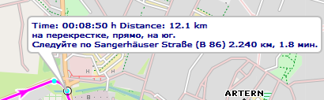

[Prev](DocFaqHandling) (Data handling) | [Home](Home) | [Manual](DocMain) | (Maps) [Next](DocFaqMaps)
- - -
[TOC]
- - -

# Frequently Asked Questions - Routing 

## Why do route instructions use different languages?

The following image shows a route instruction in which 3 languages are used:

  

The reason for this is as follows:

* The first line with English time and distance information shows data provided by the used English QMS version. This is 
the language of the operating system if QMS language files are available for this language or the default language 
in all other cases.
* The second line with Russian routing instructions shows data provided by the Routino routing algorithm used in QMS. 
The language for the routing algorithm was set by the user to Russian within QMS.
* The third line shows a German road name. This is data coming from the German map used by the Routino routing algorithm 
(this map can be different from the map displayed in the QMS view!).

## Is there a possibility to choose the preferred road class when routing?

**Source:** 
 * [www.naviboard.de](http://www.naviboard.de/vb/showthread.php?t=59418)
 * [gmane.comp.gis.qlandkartegt.user](http://article.gmane.org/gmane.comp.gis.qlandkartegt.user/2626)

Routing in QMapShack depends on the [Routino](http://routino.org) package and this package does not offer an option to select a preferred road type.

Routing profiles are saved in an XML-file (/usr/share/routino/profiles.xml). Here the preferences/weights of 
different road types can be modified by the user.

On Routino's homepage there is an online version where fine
tuning of all parameters can be tried. Once done there one can take over the values into the local `profiles.xml` file.

## What is the maximum Routino databases file size that can be handled by the QMapShack Windows version?

Due to limitations in the Windows POSIX API Routino can't handle files larger than 4GB.

## Does QMapShack/Routino support cross-border routing?

**Source:** Inspired by [newsgroup thread](https://sourceforge.net/p/qlandkartegt/mailman/qlandkartegt-users/thread/1450466213.2419.8.camel%40knibb.myzen.co.uk/#msg34706080)

Offline routing in QMapShack needs special routing databases. The easiest way to create these databases is with QMS itself
as described in the [Routes](DocGisItemsRte) section of the QMS Wiki. The required `*.pbf` input files can be downloaded per country/region.
If cross-country routing is wanted then the user should select the `*.pbf` files for all countries needed as described in the Wiki page
and then create one routing database for these countries. The resulting database supports cross-country routing. In the example shown
on the mentioned Wiki page cross-border routing all over Belgium and Luxembourg will be possible. 

If a single routing database is created for each country then these databases don't support cross-border routing.

When creating the routing database QMS executes the following Routino commands:

    path_to\planetsplitter.exe --dir=\temp --prefix=MyRegions --tagging=path_to\tagging.xml --parse-only path_to\file1.osm.pbf 
    path_to\planetsplitter.exe --dir=\temp --prefix=MyRegions --tagging=path_to\tagging.xml --parse-only --append path_to\file2.osm.pbf 
    ...
    path_to\planetsplitter.exe --dir=\temp --prefix=MyRegions --tagging=path_to\tagging.xml --process-only    

When using the standard QMS Windows installation then `planetsplitter.exe` is found in the same directory as `qmapshack.exe`,
`tagging.xml`is found in the `routino-xml` subdirectory of the `qmapshack.exe` directory.
    
These commands can be executed directly from a command line.
    
- - -
[Prev](DocFaqHandling) (Data handling) | [Home](Home) | [Manual](DocMain) | [Top](#) | (Maps) [Next](DocFaqMaps)
