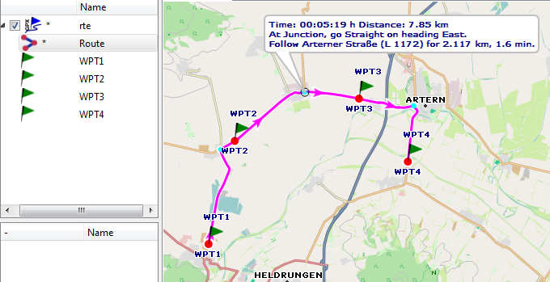
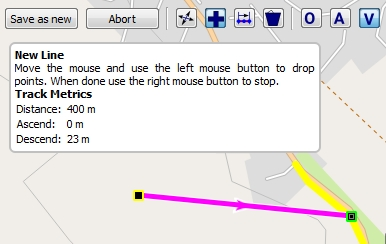

[Prev](DocFaqHandling) (Data handling) | [Home](Home) | [Manual](DocMain) | (Maps) [Next](DocFaqMaps)
- - -
[TOC]
- - -

# Frequently Asked Questions - Routing 

## How to find route instructions?

* Open some map which can display the route under consideration
* Double-click the route name to see the route on the map
* Right-click on the route name and select the context menu entry `Route Instructions`
* Points on the route with instructions are shown in light-blue
* Move the mouse pointer on a light-blue point
* See the instructions for the given point in a bubble box

## Why are only a few waypoints saved in a GPX file containing a route?

**Source:** Inspired by [newsgroup thread](https://www.tapatalk.com/topic/59991-16347) 

A typical procedure for creating a route is as follows:

* Select a routing strategy (car - bike - foot, shortest - quickest, language, ...) to be used in the routing algorithm.
* Select a series of waypoints through which the route should go.
* Start the routing algorithm to get the required route (this may automatically happens when selecting the waypoints).

When following a route the user expects at all junctions (and only there) information about the necessary 
turn in the selected language 
(next direction, road number, distance to next junction, ...). No additional information is needed and therefore 
no additional information is shown between 2 junctions.

In the following picture the selected waypoints are shown as red dots on the route. Blue dots on the route show 
junctions with routing information.

Having the ordered sequence of route waypoints and the map data (more precisely the routing data of a map) the route
can easily be recalculated by the routing algorithm. This is the reason why when saving a route in form of a portable GPX file
only the route waypoints are saved. In addition to this the GPX data format does not support the type of information
mentioned above for junctions.

When loading a route from a GPX file into QMS (or into another tool - the file format is portable!) the route has to be recalculated. 
An implication of this is that a transfer of a route
in form of a GPX file from one soft- or hardware tool to another one can lead to a different route due to a different 
routing algorithm or different map (routing) data.

QMS can transform a route into a track. This track shows exactly the path to follow but doesn't include the above mentioned
routing information for junctions. This track can be stored together with the route (more precisely the route waypoints)
in a GPX file. In this file the route and the track are 2 independent objects!

_Remark:_ There are some software applications saving a route together with this track in a proprietary 
non-portable format which links route and track data. 

## What are the features of the different routing methods in QMapShack?

When creating a new track or a new route QMS offers 3 different offline routing methods.
These methods work in the same way for track and for route creation. Therefore, only track creation will be considered.

The following basic procedure is used to create a new track:

* Open a view with some map.
* Move the mouse pointer to the first trackpoint.
* Right click and select the context menu entry `Add track`. The following image shows the initial layout of the map window:

   
  
  The toolbar icons labelled `O`, `A`, `V` have to be used in order to select the correct routing method.
  The hotkeys `CTRL-O`, `CTRL-A` and `CTRL-V` can also be used in order to select the routing method.
  
  The first trackpoint is shown with a yellow border, the next trackpoint is shown with a green border. Select
  the correct location of the green trackpoint with a left click of the mouse and proceed to the next trackpoint 
  in the same way. A change of the routing method during the track creation procedure is allowed. The newly selected
  method will be applied to all following new trackpoints.
  
* When done click right to stop the creation of new trackpoint and save the new track with the help of the `Save as new` 
button
* _Description of routing methods:_ 
  * _Method 1:_ Off-road routing:
    
    Select this method by clicking on the toolbar icon `O` or by pressing `CTRL-O` (easier!).
  
    The selected trackpoints are connected by a straight line segment as shown in the previous image.

  * _Method 2:_ Routing with a Routino database:
    
    Select this method by clicking on the toolbar icon `A` or by pressing `CTRL-A` (easier!).
  
    This method can be used only after a special preparation of an offline routing database as described in the section 
    [Routes](DocGisItemsRte). The map is used only to locate the trackpoints properly. Thus, raster maps (e.g. 
    Russian military maps)
    as shown in the following image are appropriate.

     
 
    The routing algorithm applies the parameters selected in the Route window (foot - bicycle - motorcar, ...). 
    
      * _Advantage of this method:_ Fast routing not depending on map data.
      * _Disadvantage:_ From time to time unexpected tracks longer than necessary. There are many reasons for this 
        behaviour (e.g. incorrect map data used for creating the routing database, location
        of mouse pointer not precise enough).
    
  * _Method 3:_ Routing with vector map data:

    Select this method by clicking on the toolbar icon `V` or by pressing `CTRL-V` (easier!).
  
    This method can be used only with a vector map. A routing database as described in method 2 is not required. 
    As soon as 2 consecutive trackpoints can be connected by a
    polyline (a sequence of straight line segments) contained in the map this polyline is used as part of 
    the new track connecting the waypoints considered. If such a polyline is not found in the map then a straight line 
    segment will be used to connect the trackpoints.
    
    The following image shows a first new track segment. Its endpoint is on a road of the map (a polyline of the map).
    The yellow part of the road is the extent of this polyline. If the next trackpoint is selected on this yellow part
    then the track follows this road up to this point.   
    
    
    
      * _Advantage of this method:_ Off-road and on-road routing can be mixed.
      * _Disadvantage:_ Quite often very short map polylines. Thus, many intermediate trackpoints are required.

## Is there a possibility to choose the preferred road class when routing?

**Source:** 
 * [www.naviboard.de](http://www.naviboard.de/vb/showthread.php?t=59418)
 * [gmane.comp.gis.qlandkartegt.user](http://article.gmane.org/gmane.comp.gis.qlandkartegt.user/2626)

Routing in QMapShack depends on the [Routino](http://routino.org) package and this package does not offer an option to select a preferred road type.

Routing profiles are saved in an XML-file (/usr/share/routino/profiles.xml). Here the preferences/weights of 
different road types can be modified by the user.

On Routino's homepage there is an online version where fine
tuning of all parameters can be tried. Once done there one can take over the values into the local `profiles.xml` file.

## What is the maximum Routino databases file size that can be handled by the QMapShack Windows version?

Due to limitations in the Windows POSIX API Routino can't handle files larger than 4GB.

## Does QMapShack/Routino support cross-border routing?

**Source:** Inspired by [newsgroup thread](https://sourceforge.net/p/qlandkartegt/mailman/qlandkartegt-users/thread/1450466213.2419.8.camel%40knibb.myzen.co.uk/#msg34706080)

Offline routing in QMapShack needs special routing databases. The easiest way to create these databases is with QMS itself
as described in the [Routes](DocGisItemsRte) section of the QMS Wiki. The required `*.pbf` input files can be downloaded per country/region.
If cross-country routing is wanted then the user should select the `*.pbf` files for all countries needed as described in the Wiki page
and then create one routing database for these countries. The resulting database supports cross-country routing. In the example shown
on the mentioned Wiki page cross-border routing all over Belgium and Luxembourg will be possible. 

If a single routing database is created for each country then these databases don't support cross-border routing.

When creating the routing database QMS executes the following Routino commands:

    path_to\planetsplitter.exe --dir=\temp --prefix=MyRegions --tagging=path_to\tagging.xml --parse-only path_to\file1.osm.pbf 
    path_to\planetsplitter.exe --dir=\temp --prefix=MyRegions --tagging=path_to\tagging.xml --parse-only --append path_to\file2.osm.pbf 
    ...
    path_to\planetsplitter.exe --dir=\temp --prefix=MyRegions --tagging=path_to\tagging.xml --process-only    

When using the standard QMS Windows installation then `planetsplitter.exe` is found in the same directory as `qmapshack.exe`,
`tagging.xml`is found in the `routino-xml` subdirectory of the `qmapshack.exe` directory.
    
These commands can be executed directly from a command line.
    
- - -
[Prev](DocFaqHandling) (Data handling) | [Home](Home) | [Manual](DocMain) | [Top](#) | (Maps) [Next](DocFaqMaps)
