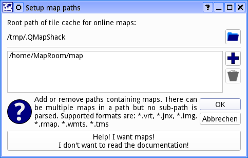
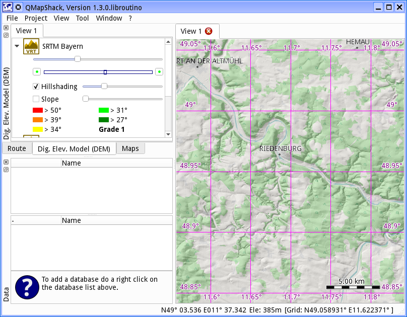

[Home](Home) | [Manual](DocMain)

[TOC]

#Getting started

This is what you get on the first start-up. 

All windows around the map workspace are docking windows. In other words you can move and re-group them as you like.

QMapShack accepts a few options on the command line. The most important ones are:

| Switch | Parameter  | Comment                                        |
|:------:|:----------:|------------------------------------------------|
|*-d*    |            | enable debug output on the console (*nix only) |
|*-f*    |            | enable debug output and write it to the file "C:\Users\your_user_name\AppData\Local\Temp\org.qlandkarte.QMapShack.log" (Windows only). |
|*-c*    |*<filename>*| read/write the configuration from/to a configuration file.|
 
If you start the application without the "-c" option the configuration will be stored wherever your system stores application configurations otherwise it is stored in <filename> at the end of a QMapShack run.

Remark for Windows users:

There is no default configuration file. Instead, the default configuration is saved in the registry branch
"HKCU\Software\QLandkarte\QMapShack".

If the configuration file does not yet exist then QMapShack is started with its default layout (configuration) shown at the top of this page and the configuration is written to the file at the end of the QMapShack run.
 
The configuration file keeps information about

* the databases used, 
 
* the routing information used,

* the map views with their structure,

* other user interface properties.

The "-c" option is pretty handy if you start QMapShack from a memory stick and want to take your
configuration with you. 

It is handy too for the definition of a top level basic data structure. The user can define and use different configuration files and in doing so define separate data and map sets (e.g. referring to different countries).
As a consequence QMapShack starts much faster due to the fact that less map data must be loaded.

On first start-up you will see an empty workspace and empty lists for maps and elevation data.

##Add maps

For the impatient ones: There is big button to install a few online map. 

For the more lettered ones: You do not add a map file directly to QMapShack. You add the path containing one or more files. There can be several paths containing maps. To add a path you select _File->Setup Map Paths_

Use the _"+" button_ to add a new path. To remove paths you select one or more and pres the _trashcan button_. If you leave the dialog with _Ok_ the map list will be updated:

However the right hand canvas is still empty. To actually display a map you have to activate it by a right click on the entry in the list and selecting _Activate_. You can activate several maps
at a time. And you can use drag-n-drop to move the activated maps in the list. The top most 
map is drawn first. The one at the bottom of the active list is drawn last.

To move the viewport use the left mouse button in a press and drag action. Use the mouse wheel 
to zoom in and out. Alternatively you can use the arrow keys to move the map and the +/- keys
to zoom. 

To read more about maps see [_Basics about maps and DEM files_](DocBasicsMapDem) and
[_Control maps and DEM files_](DocControlMapDem)

##Add digital elevation model

If you want to know the elevation at the mouse cursor's position or you want to overlay some hill shading you need Digital Elevation Model (DEM) data.

Adding files for the Digital Elevation Model (DEM) is very similar to adding maps. This time
you have to select  _File->Setup DEM Paths_. As with the maps, you have to activate a DEM file before it is used by QMapShack. You do this by a right click on the DEM file entry in the list and selecting _Activate_. 

You can change the order of the active files via drag-n-drop. An elevation query will be done 
in the order of the files. First the top most file will be queried. On success the value will be 
used. If it fails the next file is used. And so on. Consequently you place your most accurate DEM files on top of the list.

To read more about DEM files see [_Basics about maps and DEM files_](DocBasicsMapDem) and
[_Control maps and DEM files_](DocControlMapDem)