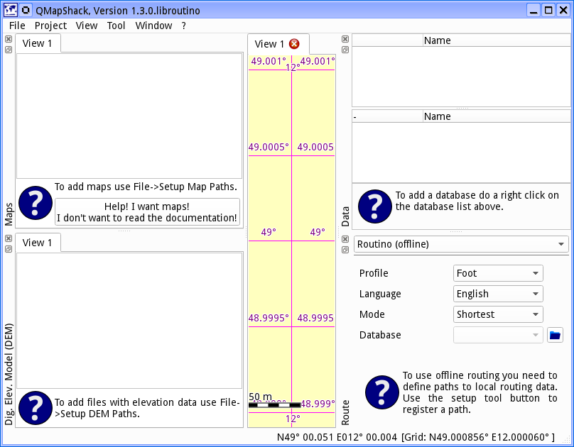

[Home](Home) | [Manual](DocMain)

#Getting started

This is what you get on the first start-up. MapRoom accepts a few options on the command line.
The most important ones are:

    -d to enable debug output on the console
    -c <filename> to read the configuration from a configuration file

The "-c" option is pretty handy if you start MapRoom from a memory stick and want to take your
configuration with you. If you just start the application like any other application the 
configuration will be stored where ever your system stores application configurations. 

On first start-up you will see an empty workspace and empty lists for maps and elevation data.

##Add maps

To add a map in MapRoom you do not add the map file directly. You add the path of the file. 
By that you can place several maps into one folder and MapRoom will find them automatically.

There can be several paths containing maps. To add a path you select _File->Setup Map Paths_

Use the _"+" button_ to add a new path. You can select one or more paths and press the 
_trashcan button_ to remove them. If you leave the dialog with _Ok_ the map list will be 
updated:

However the right hand canvas is still empty. To see a map you have to activate it by a 
right click on the entry in the list and selecting _Activate_. You can activate several maps
at a time. And you can use drag-n-drop to move the activated maps in the list. The top most 
map is drawn first. The one at the bottom of the active list is drawn last.

To move the map use the left mouse button in a press and move action. Use the mouse wheel 
to zoom in and out. Alternatively you can use the arrow keys to move the map and the +/- keys
to zoom. 

To read more about maps see [_Control maps and DEM files_](DocControlMapDem)

##Add digital elevation model

If you want to know the elevation under the mouse cursor or you want to overlay some hill shading
you need Digital Elevation Model (DEM) data.

Adding files for the Digital Elevation Model (DEM) is very similar to adding maps. This time
you have to select  _File->Setup DEM Paths_. As with the maps, you have to activate a DEM file before 
it is used by MapRoom. You do this by a right click on the DEM file entry in the list and 
selecting _Activate_. 

You can change the order of the active files via drag-n-drop. An elevation query will be done 
in the order of the files. First the top most file will be queried. On success the value will be 
used. If it fails the next file is used. And so on. Consequently you place your best DEM files 
on top of the list.

To read more about DEM files see [_Control maps and DEM files_](DocControlMapDem)