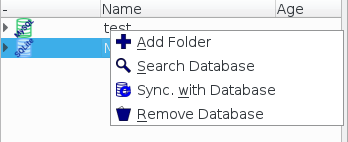
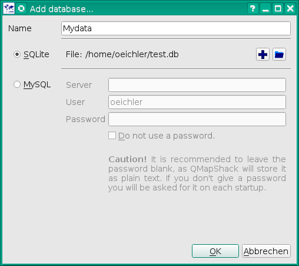

[Home](Home) | [Manual](DocMain)

[TOC]

# Add/Remove a Database

To add a database you do a right click with your mouse on some empty sapce in the the database list. You will get a context menu with an option to add a database:

You can choose between a SQLite database or a MySQL database. For a single user or an installation on a laptop with no permanent access to a network, SQLite is the better choice. If you want multiple users to access the data via network, MySQL is the option to go.

To remove a database you do a right click on the root entry of the database. 

This will remove the database from the database list, but not from your harddisc. You can load it later again.  

## SQLite

| | |
|-|-|
| Create a new database file
| Add an existing database file

##MySQL
