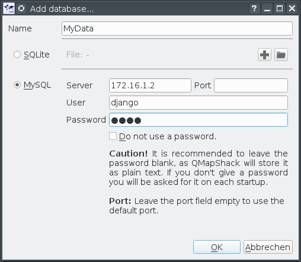

[Home](Home) | [Manual](DocMain)

[TOC]

# Add/Remove a Database

To add a database you do a right click with your mouse on some empty sapce in the the database list. You will get a context menu with an option to add a database:


You can choose between a SQLite database or a MySQL database. For a single user or an installation on a laptop with no permanent access to a network, SQLite is the better choice. If you want multiple users to access the data via network, MySQL is the option to go.

To remove a database you do a right click on the root entry of the database. 


This will remove the database from the database list, but not from your harddisc. You can load it later again.  

## SQLite


The provided name must be unique. 

| | |
|-|-|
|| Create a new database file|
|| Add an existing database file|


##MySQL

To use MySQL as database you need to enter some commands on the server first. To enter the MySQL console from the command line you do:


```
#!bash

mysql -u root -p
```

You need at least one user with full access rights, as QMapShack will create the database structure on the first start.


```
#!mysql

create user 'django'@'172.16.1.5' identified by '1234';
grant all privileges on *.* to 'django'@'172.16.1.5' with grant option;
```

Replace "django" with your user name. "172.16.1.5" with the address of your PC. And "1234" with a reasonable password. **Note: This is a very basic but fail safe setup. Please refer to the manual of your MySQL server for a more sophisticated setup.**

Keep in mind that every time QMapShack tells you that it has to migrate the database only a user with full access rights may perform the migration.

Next you want to create a database, e.g. MyData:


```
#!mysql

create database MyData;
```

You can remove a database, e.g. if something went wrong during the first start:


```
#!mysql

drop database MyData;
```

Now it's time to add the database in QMapShack.




The provided database name must be the one of the MySQL database (e.g. MyData)

| | |
|-|-|
|**Server**| A host name or an IP address of the MySQL server|
|**User**| A user login for the server|
|**Password**| The user's password for the server|