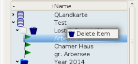
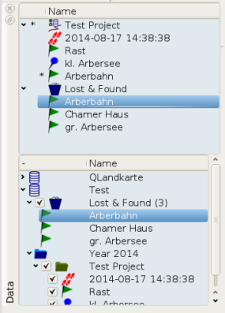

[Prev](DocGisDatabaseFoldersItems.html) (Folders and Items) | [Home](Home.html) | [Manual](DocMain.html) | (GPS Devices) [Next](DocGisDevices.html)
- - -

# 'Lost & Found' Folder

When deleting an item from a database folder the item is not deleted itself. Just the relation with that folder. All items with no relation to any folder are collected in the Lost & Found folder. Only if you delete the item form this folder it is deleted permanently. You can do this by either emptying the complete folder or by deleting selected items.

 

If you want to restore deleted items you have to load the Lost & Found folder into the workspace. 

Next you copy the items you want to restore to another project. 

This will not affect the database until you save the project.

- - -
[Prev](DocGisDatabaseFoldersItems.html) (Folders and Items) | [Home](Home.html) | [Manual](DocMain.html) | (GPS Devices) [Next](DocGisDevices.html)
