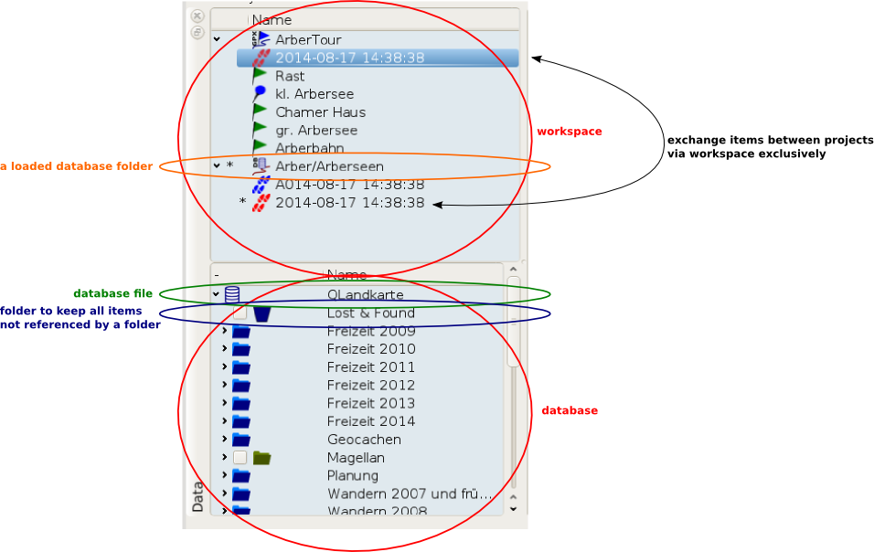

[Home](Home) | [Manual](DocMain)

# The Workspace and the Database

To work with the database you have to keep a single fundamental rule in mind. The database view is to load, unload and delete items from the database only. Everything else like adding/copying/editing data is done in the workspace. Thus you have to load the item into the workspace first. And after you have done your work you have to save it into the database.

For example if you want to copy an item from one database folder to another, you have to load both folders into the workspace, copy the item and save the folder with the item added. 