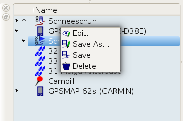

[Home](Home) | [Manual](DocMain)

[TOC]

# Working with GPS Devices

QMapShack supports data exchange with several GPS outdoor units. All newer Garmin devices accessible with mass strorage mode will work. And all devices based on the CompeGPS software TwoNav, that are accessible as mass storage.

**Linux:** Make sure you have installed the UDisks2 package.  
**Windows:** Supported from version 1.0.0 on.

**Garmin**: If you want to see your device's SD memory card you have to copy the file _GarminDevice.xml_ from the internal _Garmin_ folder to the _Garmin_ folder on your SD memory card.

After you pluged your device to the PC and switched it to mass stroage mode you should see something link this:

Each memory of the device is listed  in the workspace. If data is found on the device it will be attached as project to it's device entry.

The important part to understand is that a project on the device ist stored differently than on the workspace. For example devices won't be able to deal with the idea of hidden track points. Or it simply has no way to store all the information QMapShack is able to store. That is why projects have to be copied via the device entry to the device. And consequently projects on the device can't be copied to the workspace. This would lead to a project clash that is hard to resolve and very likely to loose data.

That understood you copy projects by drag-n-drop  to the device entry you want to store them. And after the tour you copy items like track recordings by drag-n-drop to what ever project on the workspace you want them. 

The context menu for items on devices is working, too. However with a limited range of options, as the items on the device are considered as read-only. Copy them to the workspace to change them ore to derive other items from them. Next to drag-n-drop you can use the copy option from the menu.

The context menu for the projects is working, too. Note that _Close_ is replaced _Delete_. This will delete the project from your device's memory.
