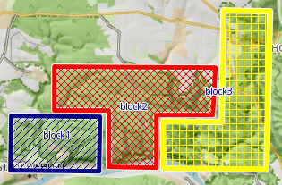
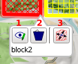
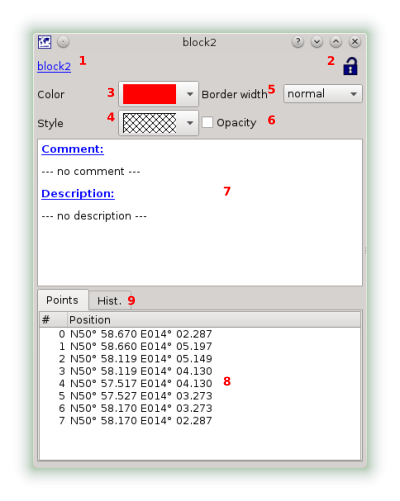

[Home](Home) | [Manual](DocMain)

# Area Overlay

An area overlay is a polygon to mark an area on a map. Commonly used by search and rescue.

Of course you can try to play Tretris  with area overlays, too.

If you click on the highlighted area you get a short on-screen-summary and a few options:

