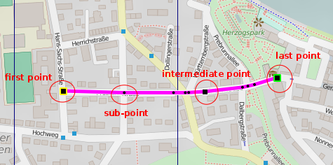

[Home](Home) | [Manual](DocMain)

# Edit items with multiple points (tracks, routes, areas)

  To edit the line of those items you have to switch into line edit mode. This will create a copy of the line. The copy can be changed and changes have to be saved to the original item or new item is created. Please be aware that especially for tracks additional data like timestamps and elevation will be lost when saving the changed line to the original item.

The line looks like:

The points that can be changed are marked by large black squares. The square under the mouse cursor is highlighted by a red square. Sub-points, introduced by auto-routing, are marked with small black dots. The first point of a line has a yellow frame. The last a green one.

In line edit mode several buttons are displayed on-screen. 

**Save to original** - This will replace the original data by the one of the edited line. The edited line only holds the coordinates and the elevation from DEM files if one is loaded for the area. Especially a track can contain much more information for each point if it is a real recording. Therefore QMapShack is the wrong tool to spoof your track recordings. It's only good to visualize real tracks and draw and edit artificial ones.

**Save as new** - Create a new GIS item.

**Abort** - Leave the line edit mode without a change.

Points and sub-points are stored different depending on the GIS item:

**Track** - On save all sub-points are converted to real points. 

**Area** -  On save all sub-points are converted to real points. 

**Route** - On save all points are stored as route waypoints. All sub-points are stored as intermediate route points. No navigation information is generated or stored. 

