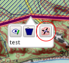
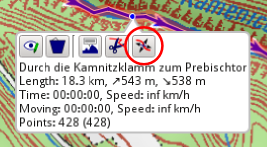
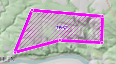
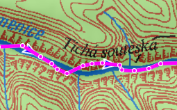
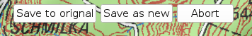
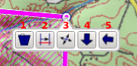
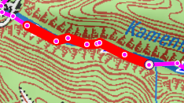
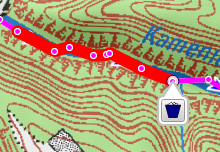
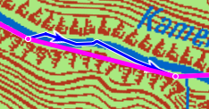
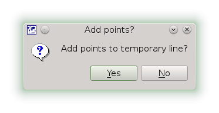

[Home](Home) | [Manual](DocMain)

# Edit items with multiple points (tracks, routes, areas)

The coordinates of items containing a polyline or polygon can be edited by switching the mouse cursor into _Line Edit Mode_. If you click on an item's point you find a tool button to do so.

 

## Line Edit Mode

In _Line Edit Mode_ a magenta line overlays the item. The item's points are marked by small bullets.

 

You will notice that you can't move the map by point-click-drag anymore. The map will move automatically if the mouse gets close to the screen borders. The arrow keys on the keyboard will still work. To zoom use the mouse wheel or the + and - key.

## Accept changes permanently

All changes will be just temporarily until you choose to apply them permanently. In _Line Edit Mode_ three buttons appear in the top left corner of the map canvas. Use the _Abort_ button to leave the line edit mode without any change to the original data. If you _Save to original_ the coordinate data will be written back, but all other data like timestamps will be lost. If you do not like this choose _Save as new_.

## Select point 

Next you click on the point you want to change and select one of the options.

1. Delete the point.
2. Start to mark a range of points
3. Move the point 
4. Add points before the current point (the arrow points into the direction the new points will be added)
5. Add points after the current point (the arrow points into the direction the new points will be added)

You can abort the selection by a click anywhere on the map. 

## Mark a range

If you choose to mark a range of points a red line will span from the selected point to the point closest to your current mouse position. You can abort the action by a right click. 

A left click on the last point in the range will fix the selection and offer you some options.

Currently the only option is to delete the complete range.

## Move a point

When moving a point it will stick to the cursor until you press the left mouse button to drop it at it's new location. If you press the right mouse button moving the point is aborted.

## Add points

You can add  points  by point-n-click on the map temporarily. A right mouse button click will finish the operation and you can choose if the new points should be part of the line permanently to the temporary line. 

