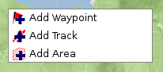

[Home](Home) | [Manual](DocMain)

# Create new tracks, waypoints etc.

You can create your own GIS items in QMapShack by a simple right mouse click on the canvas.

Select the item to add from the menu.