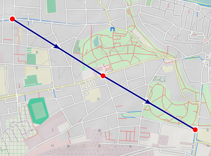
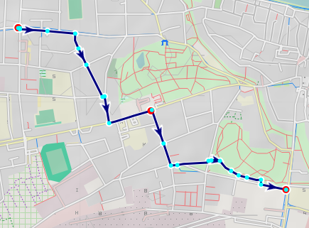
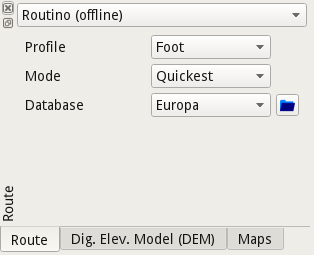

[Home](Home) | [Manual](DocMain)

# Routes (from version 1.3.0 on)

A route is a collection of waypoints with an order. The path between each point is usually a straight line. With routing information however a path using the street network can be derived. The calculation can be done by a server (online routing) or with a local database (offline routing).

 

If you click on the highlighted route you get a short on-screen-summary and a few options:


 Calculate the route. The current router selection and configuration is used. 

 Reset the route to waypoints connected with straight lines.

 Edit the route. Move waypoints, add waypoints, delete waypoints.


## Routino ##



Routino is an offline router. See it's [homepage](http://routino.org/) for more details. As it is working without an Internet connection it needs routing data locally installed. A database has four files:

```
#!text
*-nodes.mem
*-relations.mem
*-segments.mem
*-ways.mem
```

Replace the "*" with a name of the database, e-g. "Europ" or "North_America". This will be the name displayed on the GUI. The "_" will be replaced by " ".

