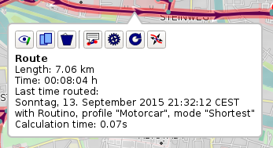

[Home](Home) | [Manual](DocMain)

# Routes (from version 1.3.0 on)

A route is a collection of waypoints with an order. The path between each point is usually a straight line. With routing information a path using the street network can be derived. The calculation can be done by a server (online routing) or with a local database (offline routing).

 

If you click on the highlighted route you get a short on-screen-summary and a few options:



 TBD

 Copy the route into another project.

 Deltete the route from the project.

 Calculate the route. The current router selection and configuration is used. 

 Reset the route to waypoints connected with straight lines.

 Edit the route. Move waypoints, add waypoints, delete waypoints.

# Routing Engines #

Currently there is only one routing engine supported. 

## Routino ##


Routino is an offline router written by Andrew M. Bishop. See the project's [homepage](http://routino.org/) for more details. As it is working without an Internet connection it needs routing data locally installed. A database needs 4 files:

```
#!text
*-nodes.mem
*-relations.mem
*-segments.mem
*-ways.mem
```

Replace the "*" with a name of the database, e.g. "Europe" or "North_America". This will be the name displayed on the GUI. The "_" will be replaced by " ".

To create a database use planetsplitter from the Routino package. Currently this is installed with the QMapShack installation. Please refer to the [online documentation](http://routino.org/documentation/usage.html) on how to use planetsplitter.

There is also a ready to use collection of database files for [download](https://jeepxj.de/pub/routino/). You have to un-zip the files into a directory and use QMapShack's Routino setup to register the path. Click the blue folder to do so.

**Windows: Due to limitations in Microsoft's POSIX API Routino can't handle files larger than 4GB. Europe exceeds that size. You have to build your own smaller database with less countries.** 

### Create Own Routino database ###

