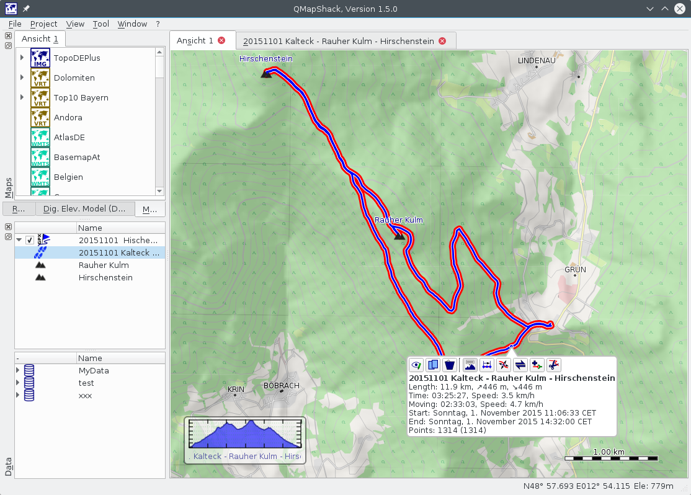

Prev () | [Home](Home.html) | [Manual](DocMain.html) | () Next
- - -

[TOC]

# Tracks

A track is a list of points recorded while moving along. Sometimes tracks are created artificially to be used for navigation.

If you click on the highlighted track you get a short on-screen-summary and a few options:

1. View / Edit track - See the full details about the track in a dialog with the option to edit the data.
2. On-screen Profile - See a track profile on the map screen and get track information close to the cursor.
3. Delete the track
4. Select Range - Select a range of track points to process.
5. Change the position data of the track points. See  ["Edit items with multiple points (tracks, routes, areas)"](DocGisItemsEditMultiple.html) for more details.
6. Reverse - Create a reverse copy of the track.
7. Combine - Combine track with other tracks.
8. Cut track - Cut the track into two tracks at the selected point.

## View / Edit Details

 Due to the nature of tracks this screen is quite complex:

1. If you hoover the mouse over one of the graphs you will see some information about the point under the cursor
2. This is the progress of the tour for the point under the mouse cursor
3. The profile plot is the elevation over the distance. The red line is the elevation from the Digital Elevation Model (if data is available see [Basics about maps and DEM files](DocBasicsMapDem.html)) You can hide & show the plot by it's checkbox.
4. The speed plot is the speed over the distance. You can hide & show the plot by it's checkbox.
5. The progress plot is the distance over time. You can hide & show the plot by it's checkbox.
6. You can select a track color from the combobox. The track will change it's color immediately.
7. You can change the name simply by starting to type. The field will be marked as changed by turning red. If you press 'Return' the name is changed and the field will turn green.
8. As mentioned in [Waypoints, Tracks & Co](DocGisItems.html) items are locked, when imported into QMapShack. If you change them all the same they are tainted, marked by the ink dot.
9. As mentioned in [Waypoints, Tracks & Co](DocGisItems.html) items are locked, when imported into QMapShack. You can edit them all the same if you unlock them by pressing the lock button.
10. This is a complete list of all track points.
11. The red dot in the track graph will show you the location of the point under the mouse cursor.
12. This is the history list showing all changes applied to the track.
13. The track summary 
14. A text browser to display links, description and comment.

## On-screen Track Information

 If you select the on-screen profile from the options you will see the profile plot in the bottom left corner of the map (1). The track will be highlighted by a red border. If you move the mouse close to the highlighted track you get some information about the point close to the mouse. It's the progress (2) of the track at that point. And it's some details about that point (3).

Optionally you can highlight the track when doing a double click on the item in workspace list. If you click on the little profile plot the details page will open.

## Combine Tracks

 You can combine the selected track with other tracks of the same project. 

1. The list of available tracks.
2. The list of already selected tracks
3. Exchange tracks between the available and selected lists by the tool buttons.
4. Change the order of the tracks to combine with the tool buttons.
5. Preview of result.

## Select Range

When entering the range selection mode you will see the normal track line with visible points and a gray shadow line with all track points. A right mouse button click will abort the selection mode at any time.

Select the first point from the visible points. And then a second one to define the range. 

You can choose from the options:

1. Hide all points between the first and the last point excluding.
2. Show all points between the first and the last point excluding.
3. Create a new track as copy of the selected track points.

Additionally you see some information about the selected range. If you click anywhere on the canvas you will abort the selection but stay in range selection mode for another selection.
- - -
Prev () | [Home](Home.html) | [Manual](DocMain.html) | () Next
