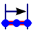
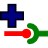

[TOC]

# Tracks #

A track is a list of points recorded while moving along. Tracks are also created artificially to be used for navigation and planning.

If you click on the highlighted track you get a short on-screen-summary and a few options:

