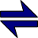
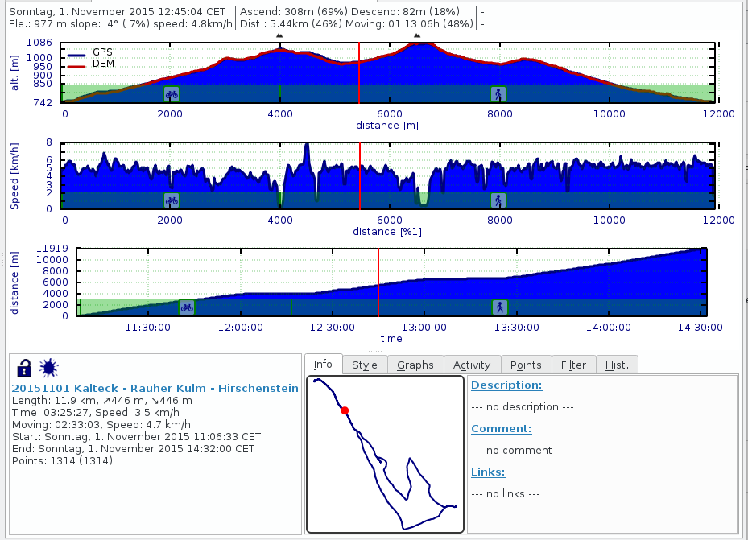

[TOC]

# Tracks #

A track is a list of points recorded while moving along. Tracks are also created artificially to be used for navigation and planning.

If you click on the highlighted track you get a short on-screen-summary and a few options:

|   |   |   |
|---|---|---|
|   | Edit/Show Details  | Show details of the track and edit data attached to the track.   |
|   | Copy  | Copy the track into another project.  |
|   | Delete  |  Delete the track. |
|   | Profile | Highlight the track and show the on-screen track profile. Btw. did you know that the key combination "ctrl+e" will make the profile a sizable and movable widget? Use the same key combination to switch back.|
|  | Range | Select a range of track points for information about that range and some additional functions (hide, show, activity, copy) |
|  | Reverse | Create a reversed copy of the track.|
|  | Combine |  Combine this track with other tracks in the project |
|  | Cut | Cut the track at the selected point. You can use that to delete points at the start or the end of the track. Or to split a track into stages. |

## Track Details Dialog ##

The dialog has 3 areas:

1) The graph area with up to three graphs. The profile graph on top is static and can't be changed. The other two graphs can display arbitrary track properties.

