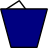
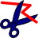
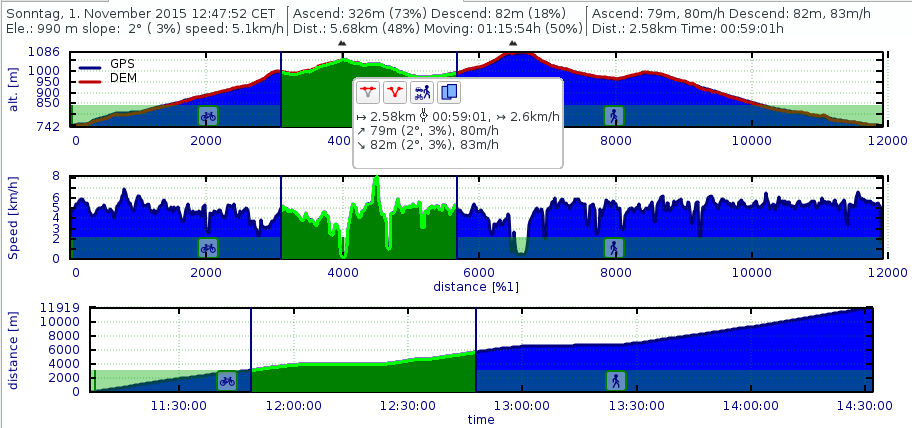
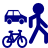
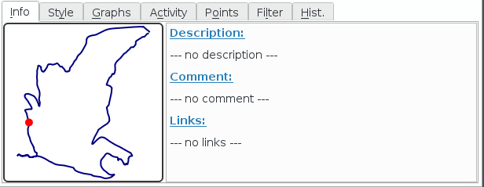
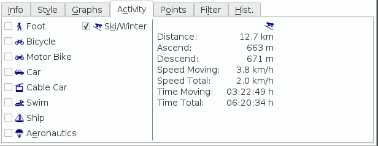
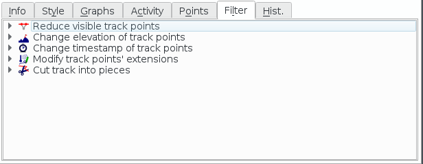

[TOC]

# Tracks #

A track is a list of points recorded while moving along. Tracks are also created artificially to be used for navigation and planning.

If you click on the highlighted track you get a short on-screen-summary and a few options:

|   |   |   |
|---|---|---|
|   | Edit/Show Details  | Show details of the track and edit data attached to the track.   |
|   | Copy  | Copy the track into another project.  |
|   | Delete  |  Delete the track. |
|   | Profile | Highlight the track and show the on-screen track profile. Btw. did you know that the key combination "ctrl+e" will make the profile a sizable and movable widget? Use the same key combination to switch back.|
|  | Range | Select a range of track points for information about that range and some additional functions (hide, show, activity, copy) |
|  | Reverse | Create a reversed copy of the track.|
|  | Combine |  Combine this track with other tracks in the project |
|  | Cut | Cut the track at the selected point. You can use that to delete points at the start or the end of the track. Or to split a track into stages. |

## Track Details Dialog ##

The dialog has 3 areas:

1) The graph area with up to three graphs. The profile graph on top is static and can't be changed. The other two graphs can display arbitrary track properties.

2) The track information area on the left bottom. It displays the same information as the on-screen summary. There are two icons:

   *  If he lock is closed the track is read only. To edit track data you have to press it.
   *  If the track has been imported and was changed it is considered as tainted. If the ink spot is visible you know the track has been altered.

3) In the tab widget on the right bottom you will find more information about the track and various tools to edit the track data and how it is presented.

### Graph Area ###

If you move the mouse over the graph area you will see some information about the current point in the text field on top. You can start a selection with a left click of your mouse. You define the end of the range by a second click. This will give you some additional information about the selected range and a few options to apply to the range.

|   |   |   |
|---|---|---|
||Hide| Hide the selected track points|
||Show| Show all track points between the first and last point of the selection |
||Activity| Mark the selected track points to be part of a selected activity|
||Copy| Copy selected track points as a new track|

Another left click on the graph will abort. 

With a right click you will see a context menu:

|   |   |   |
|---|---|---|
||Reset zoom|You can zoom on the x-axis with your mouse wheel. This can be reset by this menu item|
||Abort selection| This is another way to stop the range selection|
||Save| Save the graph as image.|

### Info ###

In the info tab you can see a small representation of your track. The red dot is the current position selected by the mouse on the graphs. You can edit the description and comment. Or add Web links. On some devices the link can be used to reference additional data.

### Style ###

### Graphs ###

### Activity ###

### Points ###

### Filter ###

### History ###

