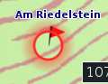
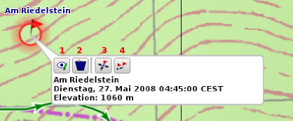
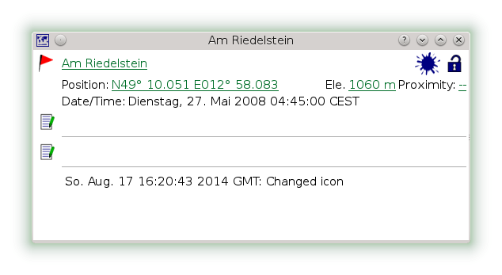
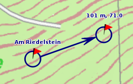
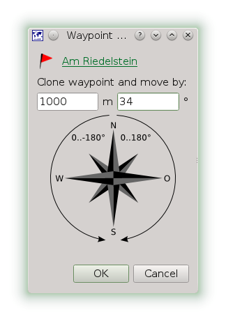

[Home](Home) | [Manual](DocMain)

# Waypoints

A waypoint is a coordinate with data attached. This can be a point of interest, a geocache or a georeferenced image. If you move the mouse close enough to a waypoint it gets highlighted by a red circle:

If you click on the highlighted waypoint you get a short on-screen-summary and a few options:

1. View / Edit waypoint - See the full details about the waypoint in a dialog with the option to edit the data.
2. Delete the waypoint
3. Move the waypoint to another location.
4. Project the waypoint - This is copying the waypoint and to move to copy a given distance and bearing

## View / Edit Details

As mentioned in [Waypoints, Tracks & Co](DocGisItems) items are locked, when imported into QMapShack. This will be shown by an icon in the top right corner (1). You can click on the lock and force the item to be unlocked. When you change anything the item gets tainted. This is shown by the ink dot (2) next to the lock. Additionally the history (3) give you a rough summary on what was changed. You can change the properties of a waypoint by clicking on the highlighted text, e.g. the name or the position. Or by clicking the tool buttons on the left side, e.g. icon, description and comment.

## Move Waypoint

When moving the waypoint the cursor will be locked to move mode. On a right mouse button click the move action is aborted. On a left mouse button click the waypoint is dropped at the new position. If the cursor is close to the viewport's border, the map is moved. 

## Project Waypoint

Different to moving the waypoint this will create a clone of the waypoint. You have to give an explicit distance and bearing the waypoint is moved. You might want to change the icon and the name.
