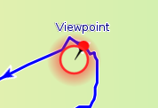
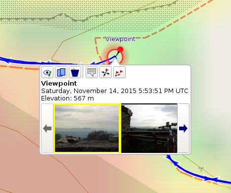
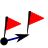
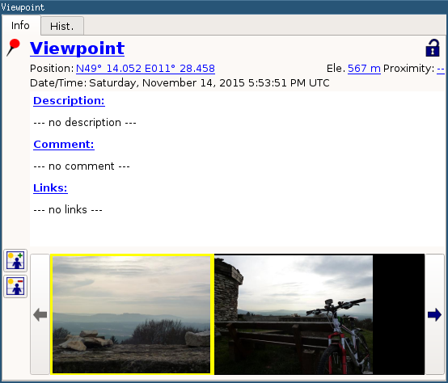
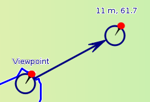
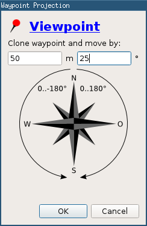

[Prev](DocGisItemsRte) (Routes) | [Home](Home) | [Manual](DocMain) | (Areas) [Next](DocGisItemsArea)
- - -
[TOC]
- - -

# Waypoints

A waypoint is a coordinate with data attached. This can be a point of interest, a geocache or a georeferenced image. If you move the mouse close enough to a waypoint it gets highlighted by a red circle:

If you click on the highlighted waypoint you get a short on-screen-summary and a few options:

|   |   |   |
|---|---|---|
|  | Edit/Show Details | [Show details of the waypoint and edit attached data.](#view-edit-details)   |
|                 | Copy              | Copy the waypoint into another project. |
|          | Delete            | Delete the waypoint. This also deletes data associated with the waypoint, such as photos. |
|        | Show Bubble       | When enabled, the waypoint's content is shown as a static bubble. |
|              | Move              | [Move the waypoint to another location.](#move-waypoint) |
|           | Project           | [Project the waypoint - This is copying the waypoint and to move to copy a given distance and bearing](#project-waypoint) |

##  View / Edit Details

|   |   |   |
|---|---|---|
|      | Icon    | Shows the currently selected Icon / provides a list of available Icon when clicked |
|  | Tainted | When shown, the Waypoint was imported and modified (for details see [Waypoints, Tracks & Co](DocGisItems)) |
|        | Locked  | When shown, the Waypoint is locked - that is cannot be modified until unlocked (for details see [Waypoints, Tracks & Co](DocGisItems)) |

In addition, the waypoint's position, elevation and a text browser to display links, description and comment are shown.
These can be changed by clicking on the blue, underlined labels.

### Custom Icons
QMapShack ships with a bunch of default icons, which are likely to be displayed correctly on the most GPS devices.

If you want to use your own icons, you need to add them to

* `~/.config/QLandkarte/WaypointIcons` (*nix-type systems)
* `c:\Users\my_user_name\.config\QLandkarte\WaypointIcons` (Windows)
* `???` (OSX)

Icon files must be in PNG or BMP format with size 24x24. 

When adding an icon *Photo.png*, the icon will be listed as *Photo* in QMapShack.

### The Photo Album

In addition to general information, such as position, name and a description, QMapShack allows attaching photos to a waypoint.
This functionality comes with several limitations, as it is primarily meant to provide a quick overview over the specific location - it is not intended to organize your collection of photos.

|   |   |   |
|---|---|---|
|  | Add (a) new image(s)  | Imports one or more new images. **Photos are scaled down on import** |
|  | Delete selected image | Remove selected image (i.e. the image with the yellow frame) |

**Photos are not exported to GPX.** Use either a Database or the QMS format for saving photos along with waypoints.

##  Move Waypoint

When moving the waypoint the cursor will be locked to move mode. On a right mouse button click the move action is aborted. On a left mouse button click the waypoint is dropped at the new position. If the cursor is close to the viewport's border, the map is moved. 

##  Project Waypoint

Different to moving the waypoint this will create a clone of the waypoint. You have to give an explicit distance and bearing the waypoint is moved. You might want to change the icon and the name.

- - -
[Prev](DocGisItemsRte) (Routes) | [Home](Home) | [Manual](DocMain) | [Top](#) | (Areas) [Next](DocGisItemsArea)
