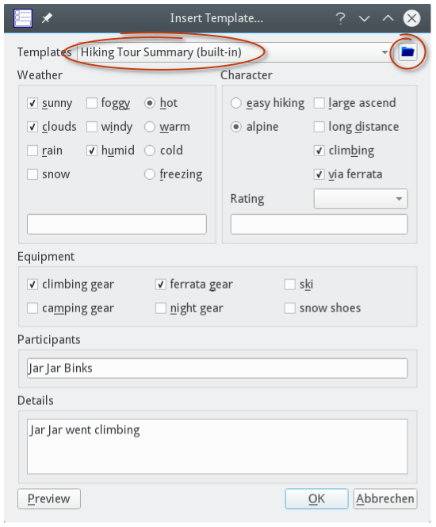
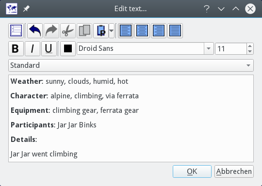
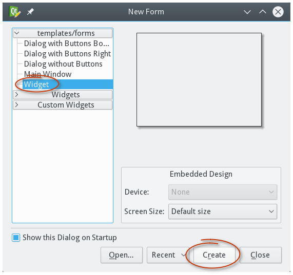
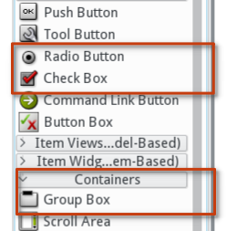
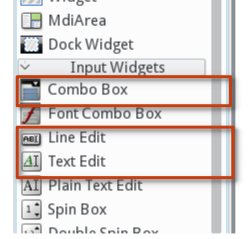
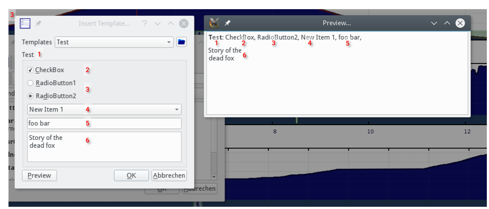
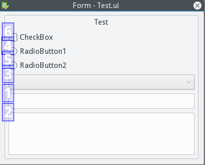

[Prev](DocGisDevices) (GPS Devices) | [Home](Home) | [Manual](DocMain) | [Index](AxAdvIndex) | (Databases and projects) [Next](AdvProjects)
- - -
[TOC]
- - -

#Text Editor Templates

*upcoming feature - not yet published*

QMapShack has the functionality to search the database or filter the workspace items by searching for a text in the items full text information. This information includes

* The item's name
* The item's short summary as seen in the bubbles.
* The item's description
* The item's comment
* For the activity if the item is a track

To make full use of these features the text in the description/comment fields should be standardized containing well known buzz words.

This can be achieved by using text templates. However as the use-case of QMapShack varies from user to user these templates must be highly flexible and customizable. The idea is to use dialogs that are defined by UI files created in Qt's Designer. With the help of QUiLoader these files can be used during run time to display a dialog to be filled out and to generate the text.

##Use a Template

To use a template you have to activate the text editor. Usually this is done by setting the item in a read/writeable mode (click on the lock in the edit dialog). The "description" and "comment" texts will become active/underlined.

If you click on the underlined text the text editor will start. The top left tool button starts the template dialog.

At the top of the template editor you can select from available templates. And there is a tool button to select a path to your own templates. If you think your own template is of general interest it would be nice to donate it to the code base of QMapShack. By that it will become a built-in template, available to everyone. And as additional benefit it will be subject to translations. 

Now you can select and edit what ever you want. Use the preview button to get an idea what the final text will look like. If you are done leave with "ok".

##Create a Template

To create your own templates you need Qt's Designer. Usually the application comes with the Qt developer package. You can use your distribution's package system or you download latest Qt Online Installer from https://www.qt.io.

Designer is a very complex software. I will only focus in the most necessary stuff. Play around to find out it's full postential. Especially the dynamic layout system needs a bit of playing to get the knack of it. 

When starting Designer you will be asked to cerate a new form. You want to create a new widget.

###Widgets Overview
On the left you will see the "Widget Box". The elements that interest you most are:

 
 

- The layouts:
  Layouts are used to dynamically align widgets on a size change. The grid layout will be the most important for our templates.
  
- The spacers:
  They look like springs. They are like springs. Spacers will use as much unused space as possible and move all other items nicely together.
  
- The buttons:
  You can use 2 different kinds: The radio button and the check box. All other buttons are of no use for our templates. Radio buttons are mutual exclusiv in a group. In other words: Only one can be checked at a time.
  
- The group box:
  It's ok to use the other containers, too. But the group box is very important as only widgets in a group box will be used to create the text.
  
- Input widgets:
  The only input widgets you can use are the combo box, the line edit and the text edit. All other widgets are useless for your template.

###Basic Concept

The basic idea is to have one or several group boxes with widgets. Group boxes are sorted by their object name. And by that in the final text, too. Only widgets inside a group box are used to create the text. Inside a group box widgets are sorted by their tab order. More on that later.
 
The object name can be changed in the right hand side property editor:

 

It is very important how the name starts:

- Group boxes must start with "group"
- Radio buttons must start with "radio"
- Check boxes must start with "check"
- Combo boxes must start with "combo"
- Line edits must start with "line"
- Text edits must start with "text"

The rest of the name is up to you. Keep in mind: group boxes are sorted by their name. 

Later when the text is produced following strings are used:

 

You can edit the widget's text either via the property editor or usually with a double click on the widget. For the line and the text edit it's usually up to the user.

###Order Of Items

Usually you want to enforce the order of the text fragments from the widgets in the final text. In fact they are sorted by the tab focus order. If you press the tab key in a dialog you will jump from widget to widget. That is the tab focus order. In Designer you have a tool to define that order:

Each widget has a number with it's position in the order. Start to click on the number that you want to have first, than second and so on.

 
 

This has to be done over all widgets regardles of the group box the widget is placed in. So it's one big order. Not one for each group box. But this has no influence on the order of the group box content in the final text as this one is defined by the group box object name.

- - -
[Prev](DocGisDevices) (GPS Devices) | [Home](Home) | [Manual](DocMain) | [Index](AxAdvIndex) | [Top](#) | (Databases and projects) [Next](AdvProjects)
