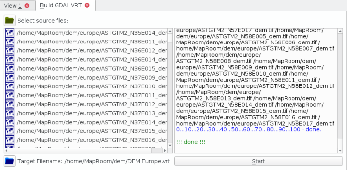

[Home](Home) | [Manual](DocMain)

[TOC]

---
# Install Maps & DEM

Sorry for not being a commercial software, that provides ready made map and DEM packages with an installer. The project does not have the financial resources to provide that kind of stuff. However we think it's really simple to install maps & DEM after you have read this.

## Organization of Maps & DEM

Maps & DEM data should be organized in folders on your system. One for maps and one for the DEM data. For example:

```
#!bash
<myglobal_path>/QMapShackData/Maps
<myglobal_path>/QMapShackData/DEM
```
You have to register these paths with ***File->Setup Map Paths*** and ***File->Setup DEM Paths*** in QMapShack. QMapShack will scan these paths for map and DEM files and lists them in the two list boxes for maps and DEM data. The filename will be the entry name. Underscores get replaced by a space.

## Installing Maps

You can start with the online maps provided by the "Help! I want maps!" button. Basically this will ask you for a path, copy some map files into the path and update the map list. If you have a Garmin device copy the \*.img and \*.jnx maps on the device to the maps folder. That should give you quite a fine collection of maps to be used by QMapShack.

## Installing Raster Maps or DEM Data

Usually this kind of data is very large. And because it is large, it is split into several files. But, as we have learned, QMapShack needs a single file to be listed. That is the point where GDAL's virtual file format (\*.vrt) jumps in. This is just a text file that defines what files in your folder should be taken as single data set. It sounds more complicated than it really is, because QMapShack provides you a tool. Open it with ***Tool->VRT Builder***.



0. Download or copy files into your map or DEM path. You can create a sub-folder to keep file chaos to a minimum. 
1. Select all the files you want to combine to one map or DEM data set. Use the tool button with the green folder.
2. Select a target filename. Use the tool button with the blue folder. Of course this should be in your map or DEM path.
3. Press the start button and watch.

When done you can reload the map or DEM list by a right click on the list. Choose ***Reload Maps*** or ***Reload DEM***. The new map should be listed.

If you want to know more about the details of creating a \*.vrt file jump [here](DocBasicsMapDem#markdown-header-gdal-vrt-maps)

---
# Sources of Maps and DEM files

## Maps
* A nice collection of Garmin vector maps can be found at [_Freizeitkarte OSM_](http://www.freizeitkarte-osm.de/). Next to ready to use maps they publish their tool chain, too. With the tool chain you can produce your own OSM based maps for any region. 
* You can use the [\*.tms files](https://sourceforge.net/projects/qlandkartegt/files/WMS%20Maps/) from QLankdarte GT (Note: the \*.xml ones won't work)

## DEM
* Still the best place to look for DEM data is [VIEWFINDER PANORAMAS](http://www.viewfinderpanoramas.org/). 
* For Europe the EEA offers [DEM files with quite good resolution](http://www.eea.europa.eu/data-and-maps/data/eu-dem). 
* For Austria you can download quite high detailed data [here](https://www.data.gv.at/katalog/dataset/d88a1246-9684-480b-a480-ff63286b35b7).

