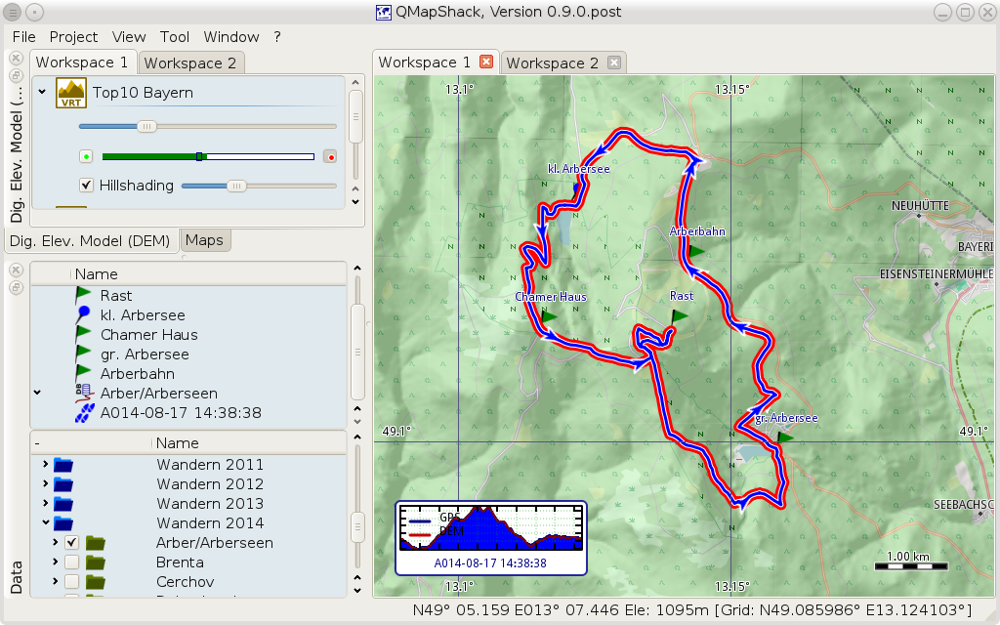

Prev () | [Home](Home) | [Manual](DocMain) | (Install QMapShack) [Next](DocGetQMapShack)
- - -
[TOC]
- - -

# QMapShack Manual

**Note**: As the software is subject to a constant development progress, this manual will
always reflect just a snapshot of the current state. Screenshots seen in this manual might 
not reflect the current appearance of the program. The manual will be updated if there are 
large changes to the GUI. However, smaller changes will be ignored. 

Users can find short quickstart descriptions here:

  [__Quick start__](DocQuickStartEnglish "English quickstart description")

  [__Schnellstartanleitung (deutsch)__](DocQuickStartGerman "German quickstart description")

## Basic usage

* Installing QMapShack

    * [Install QMapShack](DocGetQMapShack)
    * [Compile Instructions for Windows](BuildWindowsVisualStudio)
    * [Create Offline Documentation](OfflineDocumentation)

* Using QMapShack

    * [Getting started](DocGettingStarted)
    * [Command line parameters](DocCmdOptions)
    * [Install Maps & DEM Data](DocInstallMapDem)
        * [Maps & DEM](DocBasicsMapDem)
        * [Control maps and DEM files](DocControlMapDem)   
    * [Working with Projects](DocWorkingWithProjects)
        * [Handle GPX and QMS files](DocHandleGpxFiles)
        * [Search Google](DocSearchGoogle)
    * [Tracks, Waypoints & Co](DocGisItems)
        * [Create new tracks, waypoints etc.](DocGisItemsNew)
        * [Tracks](DocGisItemsTrk2)
        * [Routes](DocGisItemsRte)
        * [Waypoints](DocGisItemsWpt)
        * [Areas](DocGisItemsArea)
        * [Edit items with multiple points (tracks, routes, areas)](DocGisItemsEditMultiple)
    * [Database](DocGisDatabase)
        * [Workspace and Database](DocGisDatabaseWorkspaceDatabase)
        * [Add/Remove/Synchronize/Search a Database](DocGisDatabaseAddRemove)
        * [Folders and Items](DocGisDatabaseFoldersItems)
        * ['Lost & Found' Folder](DocGisDatabaseLostFound)
    * [GPS Devices](DocGisDevices)

## Advanced usage

* [Databases and projects](AdvProjects)
    * [General Actions](AdvProjActions)
* [Details of map use](AdvMapDetails)
    * [Maps: Tips and Tricks](DocMapsTipsTricks)              
* [Data handling](AdvDataHandling)    
    * [Tracks](AdvTracks)    
        * [General topics](AdvTrkGeneral)
        * [Track filters](AdvTrkFilters)
        * [Working with track graphs](AdvTrkGraphs)
        * [Editing elevation data](AdvTrkElevation)            
    * [Routes and Routing](AdvRoutes)
       
## Getting Help

* [Frequently Asked Questions](DocFaq)
    * [Configuring and running](DocFaqConfig)
    * [Databases and projects](DocFaqData)
    * [Data handling](DocFaqHandling)
    * [Routing](DocFaqRouting)
    * [Maps](DocFaqMaps)
* [Troubleshooting QMapShack](TroubleShooting)
* [Reporting a bug](ReportBugs)
* [Requesting a feature](RequestFeatures)

## Developing QMapShack

* [Coding Guideline](DeveloperCodingGuideline)
* [Commit Code](DeveloperCommitCode)
* [Add translations](DeveloperTranslate)
* [Developing Documentation](DevelopingDocumentation)
    * [Recommendations for editing QMS Wiki pages](AxMaintainAutoPages)
    * [Maintaining the QMS Wiki Index](AxMaintainIndex)
* [Playground - start your new Wiki page](DocPlayground)

## Appendix

* [Hotkeys](AxHotkeys) 
* [Complete table of contents](AxAdvToc)
* [Glossary](AxGlossary)
* [Index](AxAdvIndex)
* [List of images (Advanced usage and FAQ parts only)](AxWikiImages)
    
- - -
Prev () | [Home](Home) | [Manual](DocMain) | [Top](#) | (Install QMapShack) [Next](DocGetQMapShack)