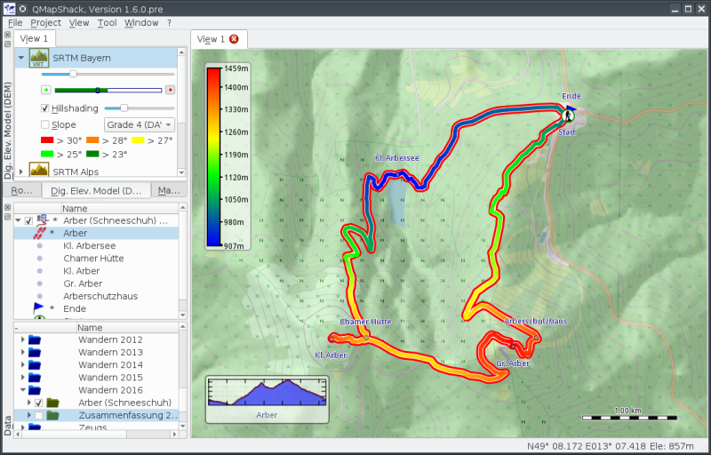

Prev () | [Home](Home) | [Manual](DocMain) | () Next
- - -
[TOC]
- - -

**QMapShack Manual**

**Note**: As the software is subject to a constant development progress, this manual will
always reflect just a snapshot of the current state. Screenshots seen in this manual might 
not reflect the current appearance of the program. The manual will be updated if there are 
large changes to the GUI. However smaller changes will be ignored. 

# __Basic QMapShack usage__

* Installing QMapShack
    * [Install QMapShack](DocGetQMapShack)
    * [Compile Instructions for Windows](BuildWindowsVisualStudio)
    * [Create Offline Documentation](OfflineDocumentation)

* Using QMapShack
    * [Getting started](DocGettingStarted)
    * [Command line parameters](DocCmdOptions)
    * [Maps & Digital Elevation Model (DEM)](DocInstallMapDem)
        * [Install Maps & DEM Data](DocInstallMapDem)
        * [Basics about maps and DEM files](DocBasicsMapDem)
        * [Control maps and DEM files](DocControlMapDem)
        * [Maps: Tips and Tricks](DocMapsTipsTricks)
    * [Working with Projects](DocWorkingWithProjects)
        * [Handle GPX and QMS files](DocHandleGpxFiles)
        * [Search Google](DocSearchGoogle)    
    * [Tracks, Waypoints & Co](DocGisItems)
        * [Create new tracks, waypoints etc.](DocGisItemsNew)
        * [Tracks](DocGisItemsTrk2)
        * [Routes](DocGisItemsRte)
        * [Waypoints](DocGisItemsWpt)
        * [Areas](DocGisItemsArea)
        * [Edit items with multiple points (tracks, routes, areas)](DocGisItemsEditMultiple)    
    * [Database](DocGisDatabase)
        * [Workspace and Database](DocGisDatabaseWorkspaceDatabase)
        * [Add/Remove/Synchronize/Search a Database](DocGisDatabaseAddRemove)
        * [Folders and Items](DocGisDatabaseFoldersItems)
        * ['Lost & Found' Folder](DocGisDatabaseLostFound)
    * [GPS Devices](DocGisDevices)

# __Advanced QMapShack usage__         

* [Databases and projects](AdvProjects)
    * [Working with projects](AdvProjActions)
* [Data handling](AdvDataHandling)    
    * [Tracks](AdvTracks)    
        * [General topics](AdvTrkGeneral)
        * [Working with track graphs](AdvTrkGraphs)
        * [Editing elevation data](AdvTrkElevation)            
    * [Routes and Routing](AdvRoutes)
       
# __Getting Help__

* [Frequently Asked Questions](DocFaqConfig)
    * [Configuring and running QMapShack](DocFaqConfig)
    * [Databases and projects](DocFaqData)
    * [Data handling](DocFaqHandling)
    * [Routing](DocFaqRouting)
    * [Maps](DocFaqMaps)
* [Troubleshooting QMapShack](TroubleShooting)
* [Reporting a bug](ReportBugs)
* [Requesting a feature](RequestFeatures)

# __Developing QMapShack__

* [Coding Guideline](DeveloperCodingGuideline)
* [Commit Code](DeveloperCommitCode)
* [Add translations](DeveloperTranslate)
* [Developing Documentation](DevelopingDocumentation)
* [Playground - start your new Wiki page](DocPlayground)

# __Appendix__

* [QMapShack hotkeys](AxHotkeys) 
* [List of images](AxWikiImages)
    
- - -
Prev () | [Home](Home) | [Manual](DocMain) | [Top](#) | () Next
