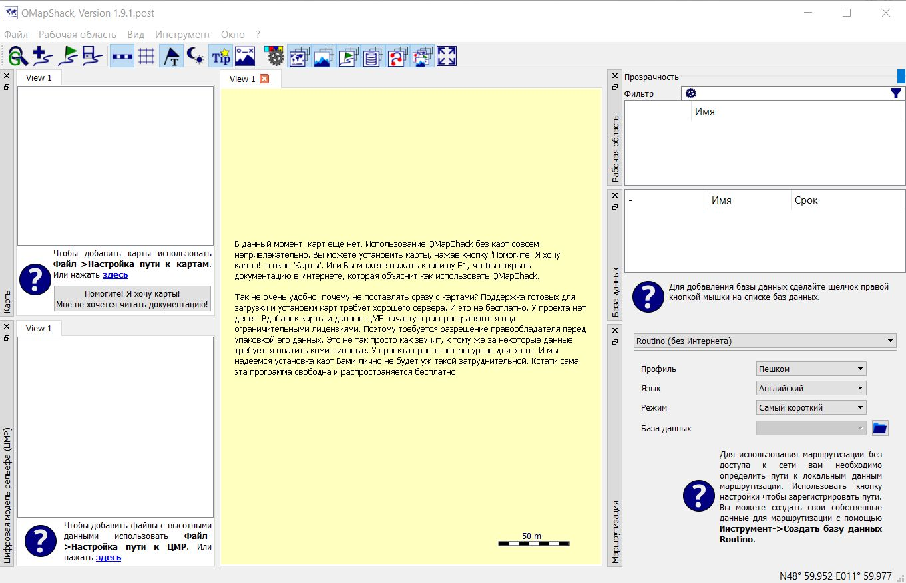
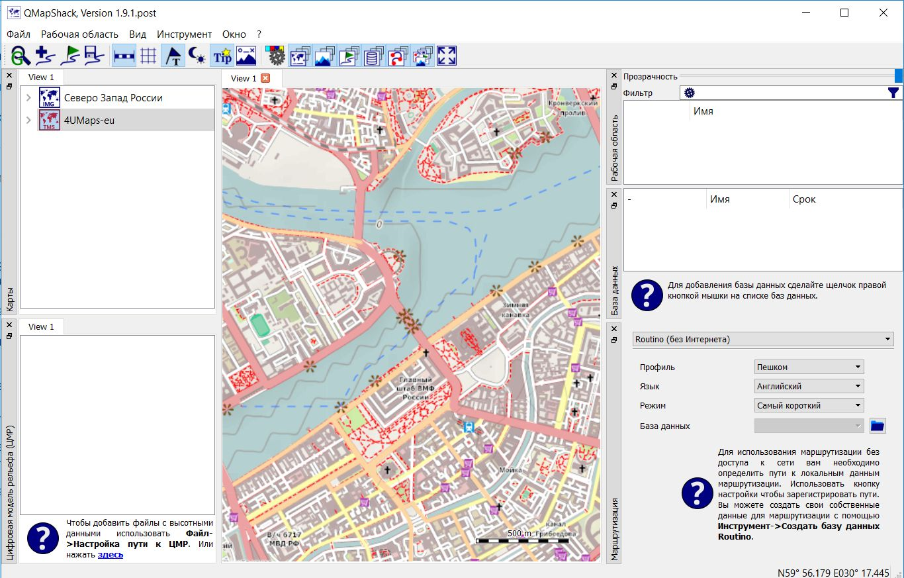
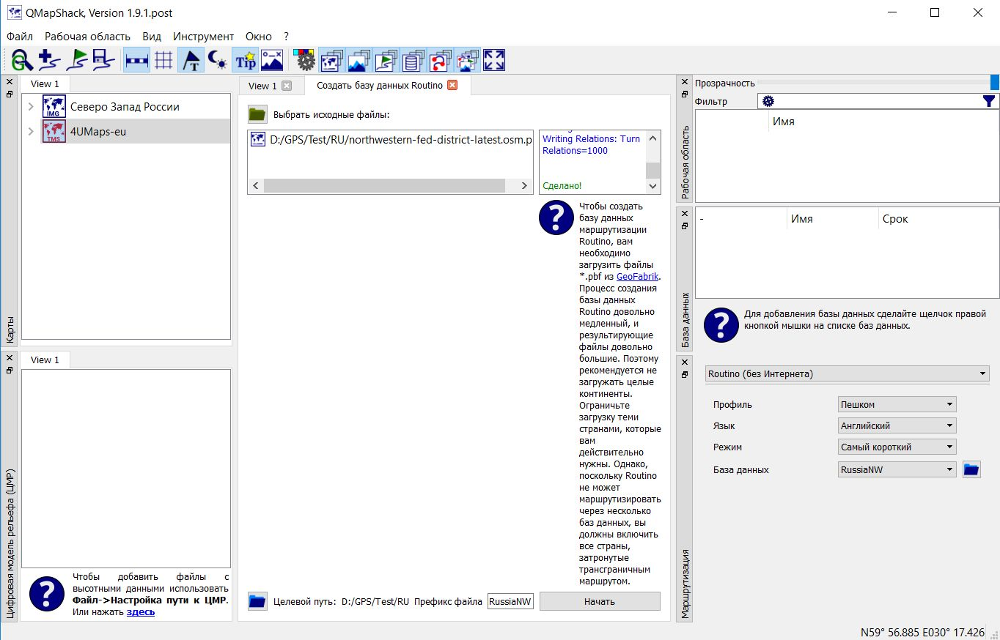
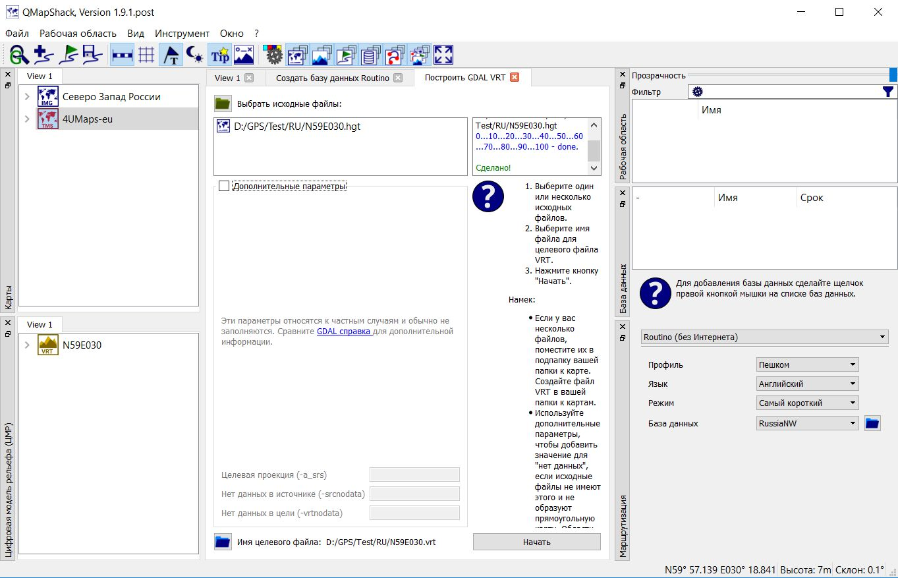
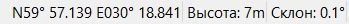
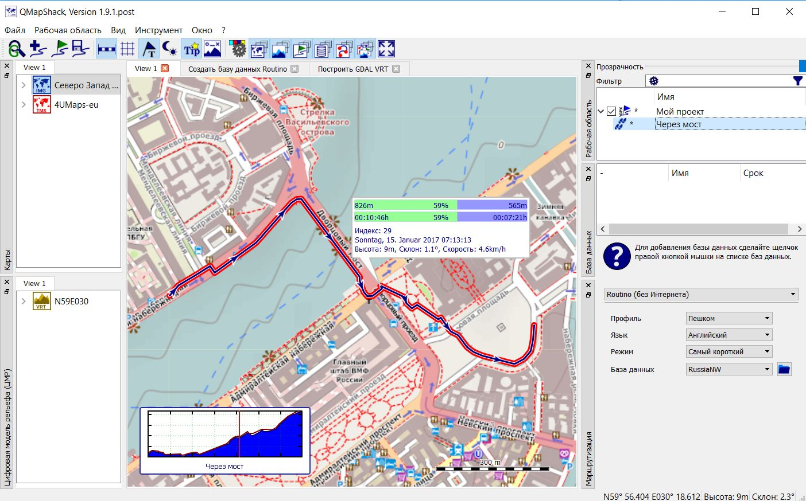
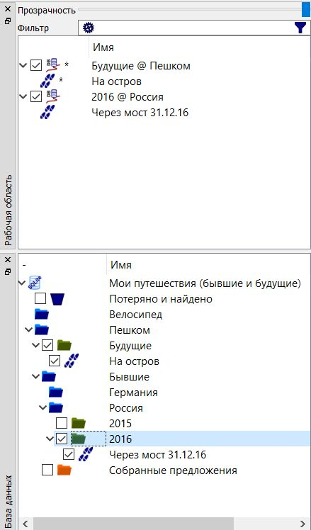
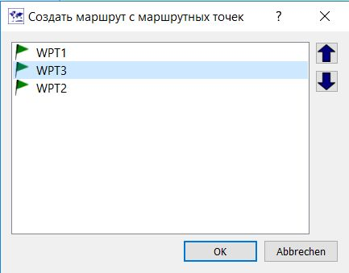
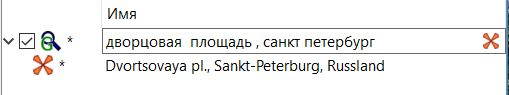

Prev () | [Home](Home) | [Manual](DocMain) | [Index](AxAdvIndex) | () Next
- - -
[TOC]
- - -

# Быстрый старт

___(Краткое резюме для пользователей Windows)___

_За исключением частей, относящихся к самой установке QMapShack данное резюме также действительно для не-Windows 
операционных систем._

QMapShack для Windows (сокращенно QMS) является 64-разрядным приложением и поэтому требует 64-разрядной операционной системы Windows.

Это резюме довольно краткое, дабы помочь пользователю быстрее приступить к работе с QMS. Многие из описанных
действий могут быть выполнены по-другому. Обсуждение этих дополнительных возможностей опускается.

Более подробная информация о QMS доступна в [Wiki](DocMain "QMS Wiki") на английском языке.

## Основные функции QMS

* Простое и гибкое использование векторных, растровых и онлайн-карт
* Использование высотных данных
* Создание/планирование маршрутов и треков с различными маршрутизаторами
* Анализ записанных данных (треков) с различных навигационных и фитнес-устройств
* Редактирование запланированных маршрутов и треков
* Структурированное сохранение данных в базах данных или файлах
* Прямое подключение для чтения и записи к современным навигационным и фитнес-устройствам

## Загрузка файлов из Интернета

_Замечания_:

* Упомянутые версии могут измениться. Последняя доступная версия всегда должна быть выбрана.
* Часто файлы могут быть выбраны на указанных страницах для определенных регионов. Пользователь должен найти тот регион, который его интересует.
* Приведенные здесь рекомендации - это типичные примеры. Есть много других вариантов!

Данные ссылки есть рекомендации для файлов, которые позволяют удобно работать с QMS.

* _QMapShack_:

    * [Загрузить QMS с сервера Bitbucket](https://bitbucket.org/maproom/qmapshack/downloads "Загрузить QMS файл начальной установки").
      Загрузить файл `QMapShack_Install_Windows64bit__1.9.1.exe` с этого сайта (около 50 МБ, номер версии может отличаться).

* _Использование карт (рекомендуется)_:

    * [Загрузить векторную карту Северо-Запада России](http://download.freizeitkarte-osm.de/garmin/latest/DNK_NOR_SWE_FIN_en_gmapsupp.img.zip "Векторная карта Северо-Запада России") 
      (Прямая ссылка на файл! Примерно 1.4 ГБ. Если используется навигационное устройство Garmin, подходящий файл `gmapsupp*.img` может уже существовать
       и может быть использован здесь).

    * _Необязательно:_ [Загрузка ссылок на онлайновые карты](http://www.mtb-touring.net/qms/onlinekarten-einbinden/ "Ссылки на онлайновые карты"). 
      _Замечание:_ Нажмите поле `Download online maps`! Результат: загруженный файл `Onlinemaps.zip`.
    
* _Поддержка маршрутизации (рекомендуется для создания новых маршрутов и треков)_:

    * [Загрузить данные Routino](http://download.geofabrik.de/russia.html "Загрузить данные Routino"). На этом сайте перейдите к строке
      `Northwestern Federal District` и нажмите в этой строке на
      `.osm.pbf`. Файл `northwestern-fed-district-latest.osm.pbf` загружается (330 МБ).
    
* _Данные высотных отметок (рекомендуется, если высотные отметки должны быть включены в новые треки)_:     

    * [Загрузка плиток с высотными данными](https://dds.cr.usgs.gov/srtm/version2_1/SRTM3/Eurasia "Загрузка плиток с высотными данными").
      Используйте координаты, чтобы выбрать нужный файл, например `N59E030.hgt.zip`. Координаты в имени файла дают юго-западной
      угол плитки.    
          
        _Или:_
      
    * [Загрузка региональных высотных данных](http://www.viewfinderpanoramas.org/Coverage%20map%20viewfinderpanoramas_org3.htm "Загрузка региональных высотных данных"). 
      На карте выберите регион и нажмите на нее. Например, загрузить файл `O36.zip`. Здесь, `O36` - это имя так называемой UTM зоны.
      
    _Замечание:_ Загрузить столько файлов, сколько необходимо для вашего региона!
      
## Установка основных компонентов

* Все загруженные файлы, как правило, находятся в пользовательской папке загрузки.
* Найдите файл `QMapShack_Install_Windows64bit__1.9.1.exe` в папке загрузки. 
* Нажмите дважды на имя файла чтобы запустить установочный файл.
* Подтвердите информацию в первых окнах установки.
* В окне `Выбор компонентов` выберите `MSVC ++ 2013 SP1 runtime` (этот шаг может быть опущен, если
  эта среда выполнения уже установлена). 
* Подтвердите запуск установки среды выполнения. _Замечание:_ Установка может длиться несколько минут!
* В конце установки среды выполнения, закончить эту установку с помощью кнопки. Установка QMS затем продолжается и QMS 
  устанавливается ​​полностью.
* QMS уже сейчас можно запустить из меню `Пуск`. Тем не менее рекомендуется выполнить еще следующие шаги.
* Создайте папку, в которой пользователь имеет разрешение на запись. В следующем обсуждении
  эту папку называется `QMS`. _Замечание:_ Пользователь не имеет 
  разрешение на запись для папки установки по умолчанию, так что в этом шаге
  должен быть создан отдельную папку для данных.
* Добавьте следующие подпапки к папке `QMS`
    * `Карты`,
    * `Routino`,
    * `DEM`,
    * `Базы_данных`.
* Откройте файл `DNK_NOR_SWE_FIN_en_gmapsupp.img.zip` (или векторной карты, которую вы загрузили) и копируйте
  файл `gmapsupp.img` в папку `Карты`.  
* Переименуйте файл `gmapsupp.img` в `Северо_Запад_России.img`.
* _Необязательно:_ Откройте файл `Onlinemaps.zip` и скопируйте файлы, содержащиеся в нем в папку `Карты`.
* _Необязательно:_ Переместите файл `northwestern-fed-district-latest.osm.pbf` (или данные Routino, которые вы загрузили) в папку `Routino`.
* _Необязательно:_ Откройте файл `N59E030.hgt.zip` или `О36.zip` и скопируйте файлы, содержащиеся в нем в папку `DEM`.

## Шаги после первого старта

* Запустите QMS из меню `Пуск` (выберите `QMapShack - QMapShack`).

    
  
* Появится пустой пользовательский интерфейс QMS (GUI). QMS пытается использовать язык операционной системы. Если QMS не поддерживает этот язык,
  то используется английский язык в качестве языка интерфейса.
   
    

    Средняя часть пользовательского интерфейса предназначена для отображения карт, для окон редактирования данных, а также для некоторых 
    других целей.
     
    4 окна на левом и правом краях (`Карты`, `Цифровая модель рельефа (ЦМР)`, `Данные`, `Маршрутизация`) можно перемещать.  Они
    могут быть закреплены в различных местах. Вы можете открывать и закрывать эти окна с помощью пункта меню `Окно`. 
 
* Графический интерфейс содержит некоторые подсказки о рекомендуемых первых действий. Они описаны в следующих пунктах. Похожая
  информация часто появляется во всплывающей справке, если мышка переместить на объект показанный на экране.
   
* _Активировать векторные карты и выбрать уровень подробности:_
    * Переместите мышку в окно `Карты`.
    * Откройте контекстное меню с правой кнопкой мышки и выберите `Настройка пути карт`.   
    * Откройте папку `QMS\Карты` и выберите эту папку. 
    * В окне для карт появится новый элемент `Северо Запад России`.
    * Откройте контекстное меню этой строки и выберите `Активировать`.
    * Переместите карту в позицию, которая содержится в карте. Карта должна быть видна.
    * Двойной щелчок на имени активированной векторной карты открывает показ настраиваемых свойств карты:
       * Прозрачность карты (слайдер).
       * Отображение областей, линий и точек.
       * Уровень подробности в карте (от -5 до 5).  
* _Необязательно: Активировать он-лайн карты: (требует выбора папки карт в предыдущем шаге!)_
    * Переместите мышку в окно `Карты`.
    * Откройте контекстное меню с правой кнопкой мышки и выберите `Перезагрузить карты`.   
    * В окне для карт появится новый элемент, в примере `4UMaps-eu` (возможно, этот элемент появился уже во время активизации векторной карты!).
    * На имени карты откройте контекстное меню с правой кнопкой мышки и выберите `Активировать`.
    * Если есть доступ к Интернету, то теперь выбранная он-лайн карта загружается (это может занять некоторое время, прогресс виден в
      среднем окне!)
  
      
    
    
* _Необязательно: Активировать маршрутизацию:_
    * Выберите пункт меню `Инструмент - Создать базу данных Routino`.
    * Откроется новое окно.
    * Выберите `QMS\Routino\northwestern-fed-district-latest.osm.pbf` в качестве исходного файла и `QMS\Routino` в качестве целевого пути.
    * Введите `RussiaNW` в качестве префикса файла.
    * Нажмите кнопку `Начать`.
    * В правой колонке окна вы можете следить за выполненными действиями. Этот процесс может длиться некоторое время!
       Завершение операции показано.
    * Перейдите к окну `Маршрутизация` и добавьте папку `QMS\Routino` с помощью значка 'Открыть'.
    * Откройте список выбора базы данных в окне `Маршрутизация` и выберите `RussiaNW`.
    * Маршруты и треки теперь могут быть созданы при поддержке офф-лайн Routino маршрутизатора (в районе, охваченном
       выбранной базы данных!).
      
      
      
      
* _Необязательно: Активировать цифровую модель рельефа:_    
    * Выберите пункт меню `Инструмент - VRT Строитель`.
    * Откроется новое окно.
    * Выберите `QMS\DEM\N59E030.hgt` в качестве исходного файла (выбор нескольких файлов HGT возможен!) и `QMS\DEM\N59E030` 
      в качестве целевого файла
      (расширение `.vrt` добавляется автоматически).
    * Нажмите кнопку `Начать`. Завершение операции будет показано.

      

    * Переместите мышку в окно `Цифровую модель рельефа (ЦМР)`.  
    * Откройте контекстное меню с правой кнопкой мышки и выберите `Настройка пути ЦМР`.
    * Выберите `QMS\DEM` как папку.
    * В окне `Цифровую модель рельефа (ЦМР)` теперь появляется, среди прочего, элемент `N59E030`.
    * Откройте контекстное меню этого элемента с правой кнопкой мышки и выберите `Активировать`.
    * Данные о высоте теперь доступны для выбранного региона (в примере юго-западный угол региона имеет координаты
      59° северной широты, 30° восточной долготы и простирается на 1° в обоих направлениях)ю
    * Наличие данных о высоте на месте расположения указателя мышки видно в строке состояния.
    
        Строка состояния без высоты:
      
        
    
        Строка состояния с высотой:
      
        
      
    
После этих шагов, работоспособное состояние QMS достигнуто.    
    
   
## Некоторые типичные операции QMS

### Изменение масштаба и перемещение карт

* _С помощью клавиатуры:_ 
    * Переместить карту в выбранном направлении с помощью клавиши со стрелкой.
    * Увеличить или уменьшить масштаб карты с помощью клавиш "__+__" или "__-__".
* _С помощью мышки:_
    * Нажать и удерживать левую кнопку мышки, чтобы зафиксировать карту к мышке. При перемещении мышки (не отпуская нажатую кнопку),
      карте перемещается. После того, как желаемую позицию на карте достигнута, отпустите кнопку мышки.
    * Используйте колесо мышки для увеличения или уменьшения масштаба карты.
    
### Загрузить GPX файл и показать данные

* _Предположение:_ Существует файл GPX `QMS\МойПроект.gpx`.
* Выберите пункт меню `Файл - Загрузить данные GIS` и выберите `QMS\MойПроект.gpx` в окне выбора файлов.
* В верхней части окна `Данные` (_окно проекта_) появляется новый элемент с именем `MойПроект`.
* После открытия проекта, путевые точки и треки в файле GPX (то есть в проекте) появляется.
* Если переместить указатель мышки на одну из строк проекта, то получите некоторую информацию о выбранном объекте.
* Двойной щелчок на строке маршрута или путевой точки центрирует выбранную карту на этот объект.

     

### Создать новую базу данных

QMS предоставляет различные формы хранения данных. Рекомендуемая и мощная форма - это хранение в
базе данных. Следующие шаги необходимы для создания базы данных:

* Переместите мышку в нижнюю половину окна `Данные` (_окно баз данных_).
* Откройте контекстное меню с правой кнопкой мышки и выберите `Добавить базу данных`.
* В следующем окне выберите имя базы данных и имя файла в виде `QMS\Базы_данных\МояБазаДанных.db`
  (оставить `SQLite` выбранным!).
* Выбранное имя базы данных появляется как новая строка в окне баз данных.

### Организация данных в базе данных

QMS базы данных являются подходящим средством для построения четкой древовидной структуры данных похожей на древовидную структуру папок.
Узлы дерева (так называемые папки) могут иметь один из трех различных типов, используемых для более четкой организации данных:

* _Группа:_ Используется только чтобы держать вместе подчиненные вложенные папки. Группы могут содержать только вложенные 
  папки, но никаких данных. Группы не показаны в окне проекта.
* _Проект, Остальное:_ Могут содержать вложенные папки и данные. Проекты и данные могут быть показаны и изменены в окне проекта.

Базы данных сохраняется физически в виде файлов. Сохранение может быть сделано вручную, или, если правильно настроено с помощью 
пункта меню `Проект - Настройка рабочей области`, автоматически через некоторого промежутка времени.

_Пример:_

Имена, выбранные в примере описывают предмет базы данных или папок.

Группа _Велосипед_ может быть заполнена с аналогичной структурой.  

Чтобы создать группу, проект и другие папки выполните следующие действия:
 
* Откройте контекстное меню с правой кнопкой мышки для базы данных или папки.
* Выберите пункт меню `Добавить папку`.
* В следующем окне выберите имя и тип папки (различные типы имеют различные цвета папки).
 
_Дополнительная информация:_ 

* Установив крючок в поле перед именем папки, папки открываются в окне проекта и данные, содержащиеся в ней (если также выбраны) 
  показаны в окне карт. Для более четкого определения источника проекта (папки) имя родительской папки добавляется
  к названию папки за разделителем "__@__". Эта дополнительная информация не добавляется к папкам верхнего уровня. Описанная 
  процедура позволяет целенаправленно и структурировано отображать выбранных данных в проекте и в окне карт.
* Изменение и удаление данных выполняется в окне проекта.
  Если данные папки были изменены, то это указывается точкой перед именами папки и данных (в данном примере
  новый трек _На остров_ еще не сохранен, и поэтому пока не имеется в базе данных).
  Измененные проекты
  необходимо регулярно сохранять в базу данных с помощью контекстного меню `Сохранить`.
* Полное удаление данных должно иметь место в окне базы данных. Удаленные данные будут перемещены в автоматически созданную
  папку `Потеряно и найдено`. Окончательное удаление должно быть сделано из этой папки. 
  Удаление в окне проекта удаляет данные из проекта, но не из базы данных.
* Дополнительно к папкам (проектам) принадлежащим к базам данных есть еще проекты, которые сохраняются непосредственно в 
  файлах типа GPX или QMS.

### Создать трек

* _Предположение:_ Установлена поддержка маршрутизации.
* Переместите мышку в окно `Маршрутизация`.
* В списке выбора в верхней части окна выберите `Routino (не в сети)`.
* В других списках выберите профиль (вид движения), язык (для инструкции о маршруте), режим (самый быстрый/самый короткий)
  и один из существующих баз данных маршрутизации (в примере `RussiaNW`)
* Переместите мышку к начальной точке трека в окне карт.
* Откройте контекстное меню с правой кнопкой мышки и выберите `Добавить трек`.
* Нажмите `Ctrl-A` на клавиатуре (это выбирает режим автоматической маршрутизации).
* Переместите мышку к следующей промежуточной точке трека и закрепите его с помощью левой кнопки мышки. Промежуточный сегмент трека
  между двумя последними выбранным точками автоматически рассчитывается в соответствии с выбранными параметрами маршрутизации. 
  Этот сегмент отображается в окне карт.
* Повторите предыдущий шаг пока конец трека не достигнут.
* Щелкните правой кнопкой мышки, чтобы закончить новый трек.
* Выберите `Сохранить как новый` на панели инструментов в верхней части окна карт.
* Введите название трека.
* Выберите имя нового проекта и `База данных` в качестве типа проекта.
* Выберите существующую базу данных.
* Выберите имя для папки в базе данных.
* Новый проект с выбранным именем появляется в окне проекта. Этот проект содержит вновь созданный трек.
* В окне базы данных появляется новая папка в используемой базе данных.
* На строке проекта откройте контекстное меню с правой кнопкой мышки и выберите `Сохранить`. Проект с его
  данными сохраняется в выбранной папке базы данных. Сохраненный трек появляется в виде строки в папку базы данных.

  
### Показать информацию о треке

Информация о треке представлена в различных формах и с разным уровнем детализации.

* _В окне проекта:_ Резюме информации о треке показывается если указатель мышки находится на имени трека в окне проекта.
* _В окне карт:_ Двойной щелчок на имени трека в окне проекта перемещает и масштабирует карту так, что трек полностью виден в окне карты. 
  Перемещение мышки на трек в окно карты дает расстояние от выбранной точки до начала и до конца трека, а также некоторую дополнительную информацию 
  (высота, скорость, ...) трека.
* _В информационном окне (окно редактирования):_ Чтобы открыть это окно, выберите `Изменить...` в контекстном меню трека в окне проекта. 
  Онo показывает итоговую информацию трека и до 3 графиков. В зависимости от доступности данных скорость, высота, наклон, ... могут 
  отображаться как функция расстояния или времени. Выберите форму графика с помощью вкладки `Графики`. Это окно также предоставляет на вкладке 
  `Фильтр` ряд фильтров для редактирования данных трека.

### Создать трек (маршрут) через путевые точки

* _Задача:_ Найти трек с помощью заданной серии путевых точек.
* _Предположение:_ Была установлена и активирована поддержка маршрутизации.
* Скопируйте, если необходимо, все необходимые путевые точки в один проект.
* Выберите в окне `Маршрутизация` желаемый маршрутизатор (Routino (offline)) и его параметры.
* Выберите, удерживая клавишу CTRL, необходимые путевые точки в желаемом порядке.
* Откройте с помощью правой кнопкой мышки контекстное меню выбранной путевой точки и выберите `Создать маршрут`.
* Проверьте и измените, если необходимо, порядок путевых точек в окне `Создать маршрут с маршрутных точек`.

    

* Нажмите `Ok`, чтобы начать создание маршрута через заданные путевые точки.
* Назначьте имя и проект новому маршруту.
* Откройте контекстное меню нового маршрута правой кнопкой мышки и выберите `Преобразовать в трек`.
* Назначьте имя и проект новому треку.

### Поиск путевой точки

* _Предположение:_ Доступ к Интернету.
* Выберите пункт меню `Проект - Поиск в Google`, чтобы открыть поле ввода в окне проекта.  
* Печатайте имя или адрес путевой точки в форме, используемой для поиска Google, и нажмите клавишу `Ввод`.
  
    
  
* Если путевая точка была найдена, результат будет показан в виде новой путевой точки под полем ввода.
* Скопируйте новую путевую точку в обычный проект для сохранения.

- - -
Prev () | [Home](Home) | [Manual](DocMain) | [Index](AxAdvIndex) | [Top](#) | () Next
