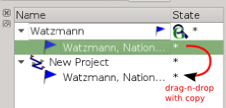

[Prev](DocHandleGpxFiles) (Handle GPX and QMS files) | [Home](Home) | [Manual](DocMain) | (Tracks, Waypoints & Co) [Next](DocGisItems)
- - -

# Search Google

The search behaves like a project. It is a toggle item. Thus you can switch it on or off. Simply type your search as you are used to it when using the browser. A return will start the search.

The result is displayed as child item of the project.

Now you can use an existing project or create a new one. 

And copy the result via drag-n-drop to the new project. 

- - -
[Prev](DocHandleGpxFiles) (Handle GPX and QMS files) | [Home](Home) | [Manual](DocMain) | (Tracks, Waypoints & Co) [Next](DocGisItems)
